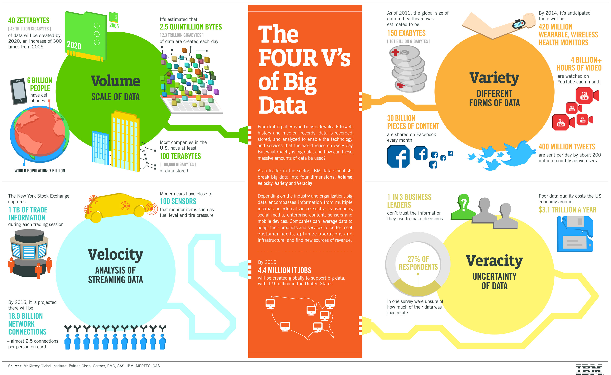

## Annoucement

1. Respond to the introduction discussion [self-introduction](https://tulane.instructure.com/courses/2238421/discussion_topics/13241432?module_item_id=30871904).

2. We will do self-introduction this Friday via zoom.

## Course logistics

- Course GitHub organization invitation <https://github.com/tulane-math-7360-2021>

  - Go to [GitHub Education](https://education.github.com/) to get your student benifit (you need to **use your tulane.edu** email address).
  
  - Once you have got your GitHub id, please tell me through email (xji4@tulane.edu).
  Your GitHub id will then be invited to the [course GitHub organization](https://github.com/tulane-math-7360-2021).
  
  - Project and homework submission via GitHub
  
  - Our course has a GitHub page.
  Please take a look at <https://tulane-math-7360-2021.github.io/> and its source code at
  <https://github.com/tulane-math-7360-2021/tulane-math-7360-2021.github.io>.
  You could check all the development history of this website through the [commit history](https://github.com/tulane-math-7360-2021/tulane-math-7360-2021.github.io/commits/main).

- Lab sessions

  - There will be recordings (not many) in the future.
  
  - *Do* need to submit the lab "work" by pushing it to your Git Repo on the course organization.
  
  - There will be "solutions" posted (after the following Monday lecture) for future lab sessions (when there are questions).

- Using R is a course objective

  - try to use R as much as possible for lab sessions and homework assignments
  
  - free to use any language for course project

- Homework assignment starts week 2.  1st assignment due on week 4.  Expected frequency: one per 2-3 weeks.

- Will provide optional reading material on Course Webpage.

- Github page contains the most up-to-date materials.

## Course Project

  - Find a dataset of interest to you.
  
  - Turn in a brief one-page description by the end of week 3. (points: 3/30)
  
  - Submit a mid-term report (2 - 4 pages, no more than 4 please) by the end of week 12.  (points: 7/30)
  
  - Present your work to your peers week 15 and 16 (December 3, 6, 8, and 10).  (points: 10/30)

  - Submit a final report (4 - 8 pages, no more than 8 please) by the end of the semester by December 18 (early submissions are encouraged).
  
  - Submit code to your own private GitHub repository on the course GitHub organization by December 18.  (Report + Code, points: 10/30)
  
  - (Optional) make a GitHub page for your project.
  
  - (Optional) make an R shiny app to showcase your findings.
  
### Project ideas/Dataset resources
  - Amazon data http://jmcauley.ucsd.edu/data/amazon/, https://nijianmo.github.io/amazon/index.html, https://cseweb.ucsd.edu/~jmcauley/datasets.html
  
  - [Netflix challenge](https://www.netflixprize.com/rules.html)
  
  - Sports/eSports prediction
  
  - Hurricane prediction!
  
  - 1000 human genome project
  
  - Reproduce findings of a paper in your field (could be hard).
  
  - Google "data science projects" to get more ideas

### More potential data source
([reference](https://sta199-f21-001.netlify.app/project/))

- [R Data Sources for Regression Analysis](https://rfun.library.duke.edu/blog/data-sources-for-regression-analysis/)

- [kaggle](https://www.kaggle.com/datasets)

- [FiveThirtyEight data](https://data.fivethirtyeight.com/)

- [TidyTuesday](https://github.com/rfordatascience/tidytuesday)

Additions:

- [World Health Organization](https://www.who.int/gho/database/en/)

- [The National Bureau of Economic Research](https://data.nber.org/data/)

- [International Monetary Fund](https://data.imf.org/?sk=388DFA60-1D26-4ADE-B505-A05A558D9A42&sId=1479329328660)

- [General Social Survey](http://gss.norc.org/)

- [United Nations Data](http://data.un.org/)

- [United Nations Statistics Division](https://unstats.un.org/home/)

- [U.K. Data](https://data.gov.uk/)

- [U.S. Data](https://www.data.gov/)

- [U.S. Census Data](https://www.census.gov/data.html)

- [European Statistics](https://ec.europa.eu/eurostat/)

- [Statistics Canada](https://www.statcan.gc.ca/eng/start)

- [Pew Research](https://www.pewresearch.org/download-datasets/)

- [UNICEF](https://data.unicef.org/)

- [CDC](https://www.cdc.gov/datastatistics/index.html)

- [World Bank](https://datacatalog.worldbank.org/)

- [Election Studies](https://electionstudies.org//)

  
### Brief Description components

  - Introduce the dataset (data type, origin, etc).  Explain why you choose the dataset.  List some questions you want to explore with the dataset.
  
### Mid-term report components

  - Include the brief description with modifications if needed
  
  - Give an abstract on your plan
    
    - What analyses you want to perform for answering your questions

  - Current progress and future plan

### Final report components

  - Introduce the dataset.  Explain why you choose it.  Explain what questions you want to ask and explore using the dataset.
  
  - Analysis.  Explain the statistical methods that you use for analyzing the dataset.  Explain what you have done to generate the results (make your analysis reproducible).
  
  - Results.  Illustrate your results.  Use figures and tables to imiprove readability.
  
  - Discussions.  This is the place to put in almost whatever you want to share.  Some difficulties you met in the analysis, what you learned from the analysis, some future directions.

## Comments from course evaluations of 2020

------------------------------------------------------------------------

## Giant's shoulders

- Previous lecture notes from Dr. Michelle Lacey (Math Department @ Tulane)

- Course material from Dr. Hua Zhou (Biostatistics Department @ UCLA)

- Various online sources

## Statistics and data science

- Statistics, the science of _data analysis_, is the applied mathematics in the 21st century.

- Data is increasing in [volume, velocity, and variety](http://www.forbes.com/sites/oreillymedia/2012/01/19/volume-velocity-variety-what-you-need-to-know-about-big-data/).

- My favorite definition of a _data scientist_:

> A data scientist is someone who is better at statistics than any software engineer and better at software engineering than any statistician.

## Big data in 1990s

@Huber94HugeData; -@Huber96MassiveData

| Data Size | Bytes          | Storage Mode               |
|-----------|----------------|----------------------------|
| tiny      | $10^2$         | piece of paper             |
| small     | $10^4$         | a few pieces of paper      |
| medium    | $10^6$ (MB)    | a floppy disk              |
| large     | $10^8$         | hard disk                  |
| huge      | $10^9$ (GB)    | hard disk(s)               |
| massive   | $10^{12}$ (TB) | hard disk(s); RAID storage |

## Big data in 21st centry

Four V's of big data:

  

Source: [IBM](http://www.ibmbigdatahub.com/infographic/four-vs-big-data).

## A typical data scientist on [Linkedin](http://linkedin.com)

  

  

## A random [online cartoon](https://cheezburger.com/6619141/19-nerdy-tech-memes-thatll-debug-your-brain) for data scientist

  

## Course description

- This course introduces some computing skills and software tools for handling data.

- Read [syllabus](https://tulane.instructure.com/courses/2238421/assignments/syllabus) and [About the course](https://tulane.instructure.com/courses/2238421/pages/about-the-course) for a tentative list of topics and course logistics.

<!-- ## References -->

