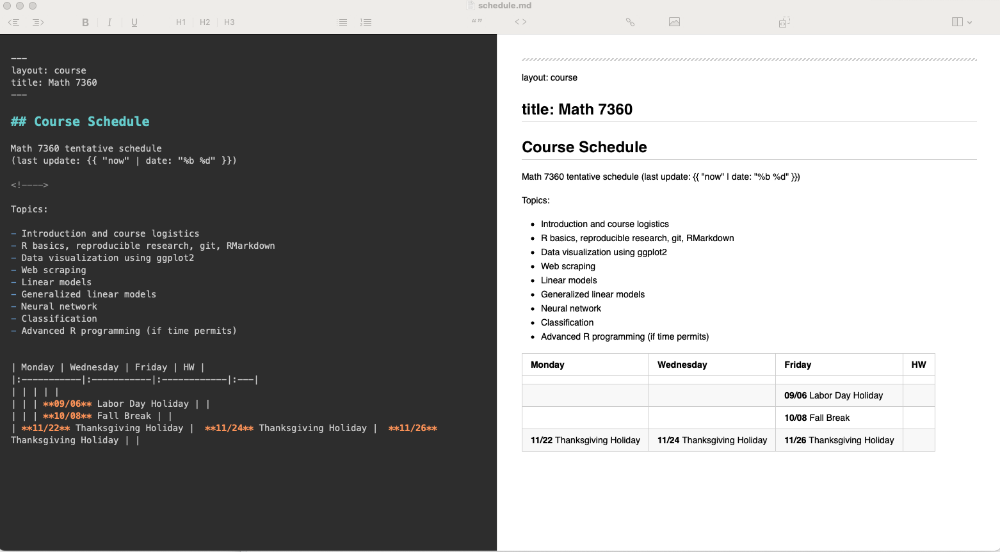
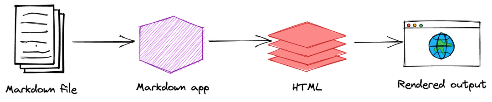

## Reference
[Markdown Guide](https://www.markdownguide.org/getting-started/)

## What is Markdown
Markdown is a lightweight markup language that you can use to add formatting elements to plaintext text documents.
Created by [John Gruber](https://daringfireball.net/projects/markdown/) in 2004, Markdown is now one of the world’s most popular markup languages.

- Using Markdown is different than using a [WYSIWYG](https://en.wikipedia.org/wiki/WYSIWYG) (What You See Is What You Get) editor.

- In an application like Microsoft Word, you click buttons to format words and phrases, and the changes are visible immediately.

- When you create a Markdown-formatted file, you add Markdown syntax to the text to indicate which words and phrases should look different.

The screen shot below shows a Markdown file displayed in [MacDown](https://macdown.uranusjr.com/) on Mac OS.

  

## Why use Markdown

Why use Markdown instead of a WYSIWYG editor?  There are acouple of reasons.

- Markdown can be used for everything.

    - [Website](https://tulane-math-7360-2021.github.io/).  (Actually, Markdown + Jekyll + GitHub)
    
    - [Document](https://www.markdownguide.org/getting-started/#documents)
    
    - Notes, Books, presentations

- Markdown syntax is easy.  [Markdown Cheat sheet](https://www.markdownguide.org/cheat-sheet/)

- Markdown translates to HTML for "free".

  

This is a four-part process:

1. Create a Markdown file using a text editor or a dedicated Markdown application.
The file should have an `.md` or `.markdown` extension.

2. Open the Markdown file in a Markdown application.

    - Markdown applications use something called a _Markdown_ _processor_ (also commonly referred to as a "parser" or an "implementation")
    to take the Markdown-formatted text and output it to HTML format.

3. Use the Markdown application to convert the Markdown file to an HTML document.

4. View the HTML file in a web browser or use the Markdown application to convert it to another file format, like PDF.

