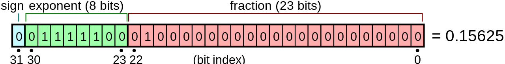
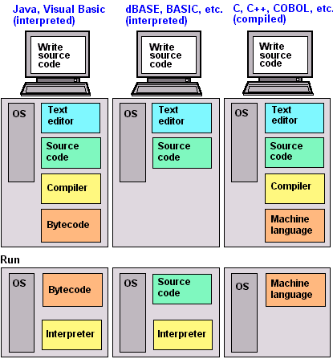

## Announcement

- Introduce yourself on Friday (the same link for lecture)

  - <https://tulane.zoom.us/j/94892763737?pwd=VTlmMStLd3hUeUhEY0UxdUZJVnk3UT09>

- Introduce yourself on Canvas [Discussion](https://tulane.zoom.us/j/94892763737?pwd=VTlmMStLd3hUeUhEY0UxdUZJVnk3UT09)

- Friday still has Lab session (but short)

## Computer storage

- _bit_ = "binary" + "digit" (0 or 1)

- _byte_ = 8 bits

- kB = kilobyte = $10^3$ bytes

- MB = megabytes = $10^6$ bytes

- GB = gigabytes = $10^9$ bytes

- TB = terabytes = $10^{12}$ bytes

- PB = petabytes = $10^{15}$ bytes

## Fixed-point number system

Fixed-point number system is a computer model for integers.
One storage unit may be $M = 8/16/32/64$ bit.

- The first bit stores the sign of the integer (i.e. 0 for positive and 1 for negative)

- The rest of the bits store the absolute value of the integer in binary

- Range of representable integers by $M$-bit storage unit is $[-2^{M - 1}, 2^{M - 1} - 1]$ (don't need to represent $0$ anymore so could have capacity for $2^{M-1}$ negative numbers).

- For $M=8$, $[-128, 127]$.  For $M=16$, $[-65536, 65535]$.  For $M=32$, $[-2147483648, 2147483647]$.

```{r}
.Machine$integer.max

# integer type in R uses M=32 bits
M <- 32
big <- 2^(M-1) - 1
small <- -2^(M-1)
as.integer(big)
as.integer(big + 1)
as.integer(small + 1)
as.integer(small)
```

- R's smallest integer is $-2^{31} + 1 = -2147483647$.

*Keep track of overflow and underflow*.  If the result of a summation is $R$, which must be in the set $[-2^{M - 1}, 2^{M - 1} - 1]$, there are only three possibilities for the true sum: $R$, $R+2^M$ (overflow), or $R-2^M$ (underflow).


## Floating-point number system

Floating-point number system is a computer model for real numbers.

<p align="center">
  
</p>


- A real is represented by $\mbox{value} = (-1)^{b_{31}} \times 2^{(b_{30} b_{29} \dots b_{23})_2 - 127} \times (1.b_{22} b_{21} \dots b_{0})_2$.

- IEEE 754-1985 and IEEE 754-2008
  
  - _Single precision_ (32 bit): base $b = 2$, $p=23$ (23 significant bits), $e_{\mbox{max}}=127$, $e_{\mbox{min}}=-126$ (8 exponent bits), $\mbox{bias} = 127$.
  This implies a maximum magnitude of $\log_{10}(2^{127}) \approx 38$ and precision to $\log_{10}(2^{23}) \approx 7$ decimal point. $\pm 10^{\pm38}$.
  
  - _Double precision_ (64 bit): base $b = 2$, $p=52$ (52 significant bits), $e_{\mbox{max}}=1023$, $e_{\mbox{min}}=-1022$ (11 exponent bits), $\mbox{bias} = 1023$.
  This implies a maximum magnitude of $\log_{10}(2^{1023}) \approx 308$ and precision to $\log_{10}(2^{52}) \approx 16$ decimal point. $\pm 10^{\pm308}$.  
  
  - In the above example, $\mbox{value} =$
  
```{r}
2^((2^2 + 2^3 + 2^4 + 2^5 + 2^6) - 127) * (1 + 2^(-2))
```

- R only uses double (64-bit) and 32-bit integer.  It can be a downside when dealing with big data.

To summarize

- Single precision: $\pm 10^{\pm38}$ with precision up to $7$ decimal digits.

- Double precision: $\pm 10^{\pm308}$ with precision up to $16$ decimal digits.

- The floating-point numbers do not occur uniformly over the real number line.

- The variable $\mbox{.Machine}$ in R contains numerical characteristics of the machine.

- How to test $\mbox{inf}$ and $\mbox{nan}$? In R

## Consequences of computer storage / arithmetic

  - Be memory conscious when dealing with big data.  E.g., human genome has about $3 \times 10^9$ bases, each of which belongs to {A, C, G, T}.
  How much storage if we store $10^6$ SNPs (single nucleotide polymorphisms) of $1000$ individuals as single (4GB), double (8GB), int32 (4GB), int16 (2GB), int8 (1GB), PLINK library format 2bit/SNP (250MB)?
  
  - Know the limit.  _Overflow_ and _Underflow_.  For double precision, $\pm 10 ^{\pm 308}$.  In most situations, underflow is "preferred" over overflow.  Overflow often causes crashes.  Underflow yields zeros (which however could lead to $0 / 0$ situations).
  
    - Example 1, in logistic regression, $p_i = \frac{\exp{(x_i^T \beta})}{1 + \exp{(x_i^T \beta})} = \frac{1}{1 + \exp{(-x_i^T \beta})}$.
  The former expression can easily lead to $\infty / \infty = NaN$, while the latter expression leads to graceful underflow.
  
    - Example 2, calculation of the probability of large amount of iid (independent and identically distributed) random variables (r.v.).
    Consider operation in log-space.
  


## Programming Languages

<p align="center">
  
</p>

Compiled versus interpreted languages.

- Compiled languages: C/C++, Fortran, ... directly compiled to machine code that is executed by CPU.  Advantage: fast, take less memory.  Disadvantage: relatively longer development time, hard to debug.

- Interpreted language: R, Matlab, SAS IML, ... Interpreted by interpreter.  Advantage: fast for prototyping.  Disadvantage: excruciatingly slow for loops.

- Mixed (compiled and then interpreted by virtual machine): Python, JAVA.  Advantage: extremely convenient for data preprocessing and manipulation; relatively short development time.  Disadvantage: not as fast as compiled language.

- Scripting: Unix/Linux scripts, Perl, Python.  Extremely useful for data preprocessing and manipulation.

- Database language: SQL, Hadoop.  Data analysis never happens if we do not know how to retrieve data from databases.

More about computer languages

- To improve efficiency of interpreted languages such as R code, avoid loops as much as possible.  Aka, vectorize code.

- For some tasks where looping is necessary (cannot vectorize code), consider conding in C/C++ or Fortran.  It is convenient to incorporate compiled code into R.

- To be versatile in dealing with big data, master at least on language in each category.

- Don't reinvent wheels.  Make good use of libraries BLAS, LAPACK, Boost, Scipy, Numpy, ...

- Distinction between compiled language and interpreted language is getting blurred.  The compiler package in R for JIT (just-in-time) compilation technology.


## R basics


### styles
(reading assignment)

Checkout [Google's R style Guide](https://google.github.io/styleguide/Rguide.html), [Style guide in Advanced R](http://adv-r.had.co.nz/Style.html#undefined)
and the [tidyverse style guide](https://style.tidyverse.org/).

### Arithmetic

R can do any basic mathematical computations.

|symbol | use |
|:-------|:---------|
| + | addition |
| - | subtraction |
| * | multiplication |
| / | division |
| ^ | power |
| %% | modulus |
| exp() | exponent |
| log() | natural logarithm |
| sqrt() | square root |
| round() | rounding |
| floor() | flooring |
| ceiling() | ceiling |

### Objects

You can create an R object to save results of a computation or other command.

Example 1

```{r}
x <- 3 + 5
x
```

 - In most languages, the direction of passing through the value into the object goes from right to left (e.g. with "=").
However, R allows both directions (which is actually bad!).
In this course, we encourage the use of "<-" or "=".
There are people liking "=" over "<-" for the reason that "<-" sometimes break into two operators "< -".

Example 2
```{r}
x < - 3 + 5
x
```

 - For naming conventions, stick with either "." or "_" (refer to the style guide).

Example 3
```{r}
sum.result <- x + 5
sum.result
```

 - _important_: many names are already taken for built-in R functions.
Make sure that you don't override them.

Example 4
```{r}
sum(2:5)
sum
sum <- 3 + 4 + 5
sum(5:8)
sum
```

 - R is case-sensitive. "Math.7360" is different from "math.7360".
 
### Locating and deleting objects:
The commands "objects()" and "ls()" will provide a list of every object that you've created in a session.

```{r}
objects()

ls()
```

The "rm()" and "remove()" commands let you delete objects (tip: always clearn-up your workspace as the first command)

```{r}
rm(list=ls())  # clean up workspace
```

### Vectors

Many commands in R generate a vector of output, rather than a single number.

The "c()" command: creates a vector containing a list of specific elements.

Example 1

```{r}
c(7, 3, 6, 0)
c(73:60)
c(7:3, 6:0)
c(rep(7:3, 6), 0)
```

Example 2
The command "seq()" creates a sequence of numbers.
```{r}
seq(7)
seq(3, 70, by = 6)
seq(3, 70, length = 6)
```


### Operations on vectors

Use brackets to select element of a vector.

```{r}
x <- 73:60
x[2]
x[2:5]
x[-(2:5)]
```

Can access by "name" (safe with column/row order changes)

```{r}
y <- 1:3
names(y) <- c("do", "re", "mi")
y[3]
y["mi"]
```

R commands on vectors

| command | usage |
|:---------|:-------|
| sum()   | sum over elements in vector |
| mean()  | compute average value |
|sort() | sort elements in a vector |
| min(), max() | min and max values of a vector|
|length() | length of a vector |
|summary() | returns the min, Q1, median, mean, Q3, and max values of a vector |
<!-- | sample(x, size, replace = FALSE, prob = NULL) | takes a random sample from a vector with or without replacement| -->

**Exercise**
Write a command to generate a random permutation of the numbers between 1 and 5 and save it to an object.
