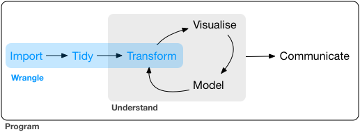

```{r}
rm(list = ls()) # clean-up workspace
sessionInfo()
```

## Announcement

- Poll on HW1 extension

- Profiling example with pre-allocation: you do not know unless you profile.

  - What I forgot last time: the size of `data` is different in the last two cases.
  
  - The example with pre-allocated memory ran too fast that I had to increase the size by 10 fold to accommodate for the timer.

- `read.csv()`, `read.table()`, `read.delim()` functions import data from files.
  ```{r}
  (oringp <- read.table("https://raw.githubusercontent.com/tulane-math-7360-2021/tulane-math-7360-2021.github.io/main/HW/HW1/oringp.dat"))
  (oringp <- read.table("../../HW/HW1/oringp.dat"))
  ```
- **One-page** project description due today.

- Facilities email: please move furniture back after class.

## Acknowledgement

Dr. Hua Zhou's [slides](https://ucla-biostat203b-2020winter.github.io/slides/05-tidy/tidy.html)


## Source
We follow [R for Data Science](http://r4ds.had.co.nz) by Garrett Grolemund and Hadley Wickham for the next couple of lectures.


## Workflow

A typical data science project:

<p align="center">

</p>

- Data wrangling.

    - The art of getting your data into R in a useful form for visualisation and modelling.
    
    - Data import

    - Data transformation.

        - select important variables
        
        - filter out key observations
        
        - create new variables
        
        - compute summaries
    
- Visualisation.

    - Make elegant and informative plots that help you understand data.

## Data wrangling

There are three main parts to data wrangling:
<p align="center">

</p>

We will proceed with:

- [tibbles](https://r4ds.had.co.nz/tibbles.html) | r4ds chapter 10

    - A data frame variant
    
    - how to construct them

- [data import](https://r4ds.had.co.nz/data-import.html) | r4ds chapter 11

    - how to get data from disk into R

- [tidy data](https://r4ds.had.co.nz/tidy-data.html#tidy-data-1) | r4ds chapter 12

    - a consistent way of storing your data that makes everything easier (transformation, visualisation, and modelling)
    
## [Tidyverse](https://www.tidyverse.org)

- `tidyverse` is a collection of R packages that make data wrangling easy.

- Install `tidyverse` from RStudio menu `Tools -> Install Packages...` or
    ```{r, eval = FALSE}
    install.packages("tidyverse")
    ```

- After installation, load `tidyverse` by
    ```{r}
    library("tidyverse")
    environment(filter)
    environment(stats::filter)
    ```
    
## Tibbles

Tibbles are one of the unifying features of the tidyverse.

### create tibbles

- coerce a data frame to a tibble `as_tibble()`

    - Most other R packages use regular data frames.
    
    - `iris` is a data frame available in base R:
    
    ```{r}
    # a regular data frame
    iris
    ```
    
    - Convert a regular data frame to tibble:
    ```{r}
    as_tibble(iris)
    ```

    - Convert a tibble to data frame:
    ```{r, eval = FALSE}
    as.data.frame(tb)
    ```
    
----

- Create tibble from individual vectors. 

    ```{r}
    tibble(
      x = 1:5, 
      y = 1, 
      z = x ^ 2 + y
    )
    ```
    - Note values for y are recycled
    
      - We know that scalars are just length-1 vectors, how does R perform operations between vectors of different length?
      
        - If the longer object length **is** multiple of the shorter object length, the shorter object is recycled
        
        - If the longer object length is **not** multiple of the shorter object length, R outputs a warning
      ```{r}
      long.vec <- 1:10
      short.vec.1 <- 1:2
      short.vec.2 <- 1:3
      (long.vec * short.vec.1)
      (long.vec + short.vec.1)
      (long.vec * short.vec.2)
      (long.vec + short.vec.2)
      ```

    - Only length one vectors are recycled
      ```{r,  error=TRUE}
      tibble(
        x = 1:5, 
        y = 1:2, 
        z = x ^ 2 + y
      )
      ```
    
    - `tibble()` does less than `data.frame()`:
    
        1. never changes the type of the inputs (e.g. it never converts strings to factors)
        
        2. never changes the names of variables
        
        3. never creates row names

- Transposed tibbles:
    ```{r}
    tribble(
      ~x, ~y, ~z,
      #--|--|----
      "a", 2, 3.6,
      "b", 1, 8.5
    )
    ```

----

## Printing of a tibble

- By default, tibble prints the first 10 rows and all columns that fit on screen.

    - you don't accidentally overwhelm your console when printing large data frames
    ```{r}
    nycflights13::flights
    ```

- To change number of rows and columns to display:
    ```{r}
    nycflights13::flights %>% 
      print(n = 10, width = Inf)
    ```
Here we see the **pipe operator** `%>%` pipes the output from previous command to the (first) argument of the next command.


- To change the default print setting:
    - `options(tibble.print_max = n, tibble.print_min = m)`: if more than `n` rows, print only `m` rows.
    - `options(tibble.print_min = Inf)`: print all roww.
    - `options(tibble.width = Inf)`: print all columns.

----

## Subsetting

- 
    ```{r}
    df <- tibble(
      x = runif(5),
      y = rnorm(5)
    )
    df
    ```

- Extract by name:
    ```{r}
    df$x
    df[["x"]]
    ```
    
- Extract by position：
    ```{r}
    df[[1]]
    ```

- Pipe:
    ```{r}
    df %>% .$x
    df %>% .[["x"]]
    ```
`.` is a special placeholder.

## Data import | r4ds chapter 11

### readr

- `readr` package implements functions that turn flat files into tibbles.

    - `read_csv()` (comma delimited files), `read_csv2()` (semicolon seperated files), `read_tsv()` (tab delimited files),  `read_delim()` (any delimiter).

    - `read_fwf()` (fixed width files), `read_table()`.

    - `read_log()` (Apache style log files). 

- An example file [heights.csv](https://raw.githubusercontent.com/ucla-biostat203b-2020winter/ucla-biostat203b-2020winter.github.io/master/slides/05-tidy/heights.csv):
    ```{bash}
    head heights.csv
    ```

----

- Read from a local file [heights.csv](https://raw.githubusercontent.com/ucla-biostat203b-2020winter/ucla-biostat203b-2020winter.github.io/master/slides/05-tidy/heights.csv):
    ```{r}
    (heights <- read_csv("heights.csv"))
    ```

----

- I'm curious about relation between `earn` and `height` and `sex`
    ```{r}
    ggplot(data = heights) + 
      geom_point(mapping = aes(x = height, y = earn, color = sex))
    ```
    
----

- Read from inline csv file:
    ```{r}
    read_csv("a,b,c
      1,2,3
      4,5,6")
    ```

- Skip first `n` lines:
    ```{r}
    read_csv("The first line of metadata
      The second line of metadata
      x,y,z
      1,2,3", skip = 2)
    ```
    
----

- Skip comment lines:
    ```{r}
    read_csv("# A comment I want to skip
      x,y,z
      1,2,3", comment = "#")
    ```
    
- No header line:
    ```{r}
    read_csv("1,2,3\n4,5,6", col_names = FALSE)
    ```

----

- No header line and specify colnames:
    ```{r}
    read_csv("1,2,3\n4,5,6", col_names = c("x", "y", "z"))
    ```
    
- Specify the symbol representing missing values:
    ```{r}
    read_csv("a,b,c\n1,2,.", na = ".")
    ```
    
### Writing to a file

- Write to csv:
    ```{r, eval = FALSE}
    write_csv(challenge, "challenge.csv")
    ```
    
- Write (and read) RDS files:
    ```{r, eval = FALSE}
    write_rds(challenge, "challenge.rds")
    read_rds("challenge.rds")
    ```

### Excel files

<p align="center">

</p>


- readxl package (part of tidyverse) reads both xls and xlsx files:
    ```{r}
    library(readxl)
    # xls file
    read_excel("datasets.xls")
    ```
    ```{r}
    # xls file
    read_excel("datasets.xlsx")
    ```
    
- List the sheet name:
    ```{r}
    excel_sheets("datasets.xlsx")
    ```

- Read in a specific sheet by name or number:
    ```{r}
    read_excel("datasets.xlsx", sheet = "mtcars")
    ```
    ```{r}
    read_excel("datasets.xlsx", sheet = 4)
    ```

- Control subset of cells to read:
    ```{r}
    # first 3 rows
    read_excel("datasets.xlsx", n_max = 3)
    ```
    Excel type range
    ```{r}
    read_excel("datasets.xlsx", range = "C1:E4")
    ```
    ```{r}
    # first 4 rows
    read_excel("datasets.xlsx", range = cell_rows(1:4))
    ```
    ```{r}
    # columns B-D
    read_excel("datasets.xlsx", range = cell_cols("B:D"))
    ```
    ```{r}
    # sheet
    read_excel("datasets.xlsx", range = "mtcars!B1:D5")
    ```

- Specify `NA`s:
    ```{r}
    read_excel("datasets.xlsx", na = "setosa")
    ```

- Writing Excel files: `openxlsx` and `writexl` packages.

### Other types of data

- **haven** reads SPSS, Stata, and SAS files.

- **DBI**, along with a database specific backend (e.g. **RMySQL**, **RSQLite**, **RPostgreSQL** etc) allows you to run SQL queries against a database and return a data frame.

- **jsonlite** reads json files.

- **xml2** reads XML files.

- **tidyxl** reads non-tabular data from Excel.

## Tidy data | r4ds chapter 12

> “Happy families are all alike; every unhappy family is unhappy in its own way.” –– Leo Tolstoy
>
> “Tidy datasets are all alike, but every messy dataset is messy in its own way.” –– Hadley Wickham

### Tidy data

There are three interrelated rules which make a dataset tidy:

- Each variable must have its own column.

- Each observation must have its own row.

- Each value must have its own cell.

<p align="center">

</p>

----

- Example table1
    ```{r}
    table1
    ```
is tidy.

----

- Example table2
    ```{r}
    table2
    ```
is not tidy.

----

- Example table3
    ```{r}
    table3
    ```
is not tidy.
    
----

- Example table4a
    ```{r}
    table4a
    ```
is not tidy.    

- Example table4b
    ```{r}
    table4b
    ```
is not tidy.


## Gathering

<p align="center">

</p>

- `gather` columns into a new pair of variables.
    ```{r}
    table4a %>%
      gather(`1999`, `2000`, key = "year", value = "cases")
    ```

----

- We can gather table4b too and then join them
    ```{r}
    tidy4a <- table4a %>% 
      gather(`1999`, `2000`, key = "year", value = "cases")
    tidy4b <- table4b %>% 
      gather(`1999`, `2000`, key = "year", value = "population")
    left_join(tidy4a, tidy4b)
    ```

## Spreading

<p align="center">

</p>

- Spreading is the opposite of gathering.
    ```{r}
    spread(table2, key = type, value = count)
    ```

## Separating

<p align="center">

</p>

- 
    ```{r}
    table3 %>% 
      separate(rate, into = c("cases", "population"))
    ```

----

- Seperate into numeric values:
    ```{r}
    table3 %>% 
      separate(rate, into = c("cases", "population"), convert = TRUE)
    ```

----

- Separate at a fixed position:
    ```{r}
    table3 %>% 
      separate(year, into = c("century", "year"), sep = 2)
    ```

## Unite

<p align="center">

</p>

- 
    ```{r}
    table5
    ```

----

- `unite()` is the inverse of `separate()`. 
    ```{r}
    table5 %>% 
      unite(new, century, year, sep = "")
    ```