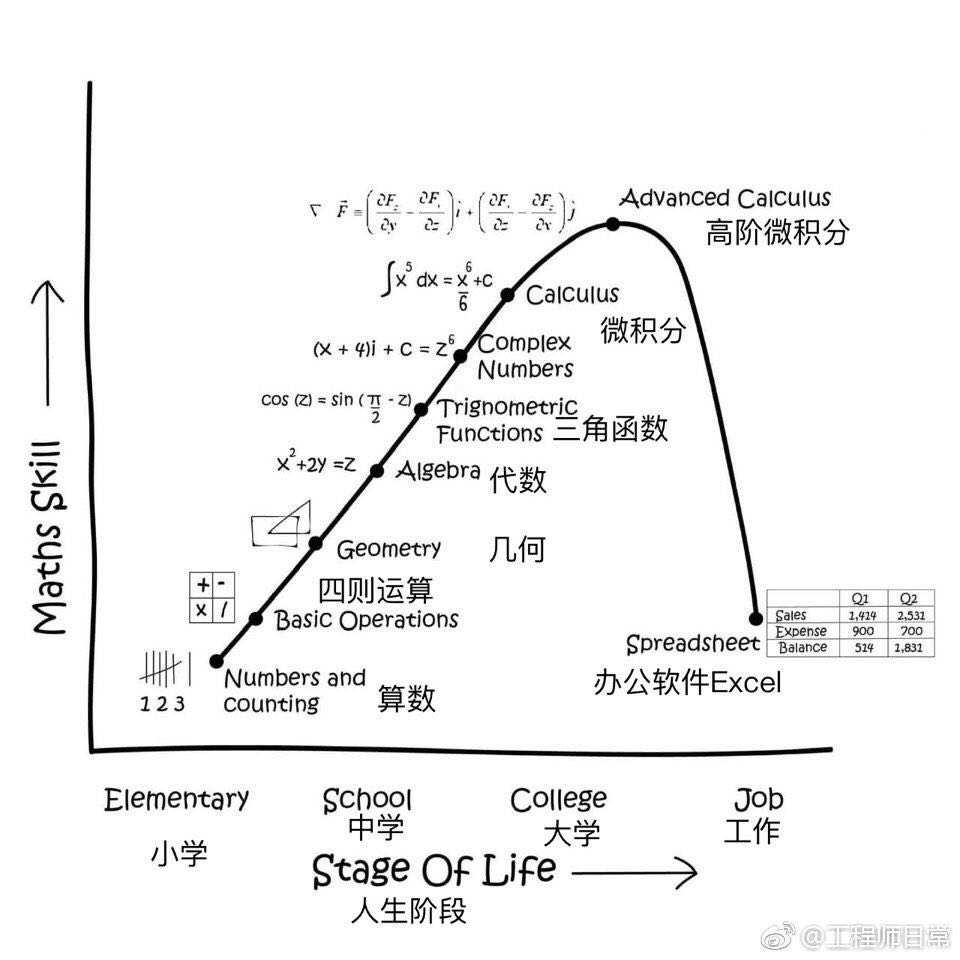

```{r}
rm(list = ls()) # clean-up workspace
library("tidyverse")
```

## Acknowledgement

Dr. Hua Zhou's [slides](https://ucla-biostat203b-2020winter.github.io/slides/05-tidy/tidy.html)


## Data import | r4ds chapter 11

### readr

- `readr` package implements functions that turn flat files into tibbles.

    - `read_csv()` (comma delimited files), `read_csv2()` (semicolon seperated files), `read_tsv()` (tab delimited files),  `read_delim()` (any delimiter).

    - `read_fwf()` (fixed width files), `read_table()`.

    - `read_log()` (Apache style log files). 

- An example file [heights.csv](https://raw.githubusercontent.com/ucla-biostat203b-2020winter/ucla-biostat203b-2020winter.github.io/master/slides/05-tidy/heights.csv):
    ```{bash}
    head heights.csv
    ```

----

- Read from a local file [heights.csv](https://raw.githubusercontent.com/ucla-biostat203b-2020winter/ucla-biostat203b-2020winter.github.io/master/slides/05-tidy/heights.csv):
    ```{r}
    (heights <- read_csv("heights.csv"))
    ```

----

- I'm curious about relation between `earn` and `height` and `sex`
    ```{r}
    ggplot(data = heights) + 
      geom_point(mapping = aes(x = height, y = earn, color = sex))
    ```
    
----

- Read from inline csv file:
    ```{r}
    read_csv("a,b,c
      1,2,3
      4,5,6")
    ```

- Skip first `n` lines:
    ```{r}
    read_csv("The first line of metadata
      The second line of metadata
      x,y,z
      1,2,3", skip = 2)
    ```
    
----

- Skip comment lines:
    ```{r}
    read_csv("# A comment I want to skip
      x,y,z
      1,2,3", comment = "#")
    ```
    
- No header line:
    ```{r}
    read_csv("1,2,3\n4,5,6", col_names = FALSE)
    ```

----

- No header line and specify colnames:
    ```{r}
    read_csv("1,2,3\n4,5,6", col_names = c("x", "y", "z"))
    ```
    
- Specify the symbol representing missing values:
    ```{r}
    read_csv("a,b,c\n1,2,.", na = ".")
    ```
    
### Writing to a file

- Write to csv:
    ```{r, eval = FALSE}
    write_csv(challenge, "challenge.csv")
    ```
    
- Write (and read) RDS files:
    ```{r, eval = FALSE}
    write_rds(challenge, "challenge.rds")
    read_rds("challenge.rds")
    ```

### Excel files

<p align="center">

</p>


- readxl package (part of tidyverse) reads both xls and xlsx files:
    ```{r}
    library(readxl)
    # xls file
    read_excel("datasets.xls")
    ```
    ```{r}
    # xls file
    read_excel("datasets.xlsx")
    ```
    
- List the sheet name:
    ```{r}
    excel_sheets("datasets.xlsx")
    ```

- Read in a specific sheet by name or number:
    ```{r}
    read_excel("datasets.xlsx", sheet = "mtcars")
    ```
    ```{r}
    read_excel("datasets.xlsx", sheet = 4)
    ```

- Control subset of cells to read:
    ```{r}
    # first 3 rows
    read_excel("datasets.xlsx", n_max = 3)
    ```
    Excel type range
    ```{r}
    read_excel("datasets.xlsx", range = "C1:E4")
    ```
    ```{r}
    # first 4 rows
    read_excel("datasets.xlsx", range = cell_rows(1:4))
    ```
    ```{r}
    # columns B-D
    read_excel("datasets.xlsx", range = cell_cols("B:D"))
    ```
    ```{r}
    # sheet
    read_excel("datasets.xlsx", range = "mtcars!B1:D5")
    ```

- Specify `NA`s:
    ```{r}
    read_excel("datasets.xlsx", na = "setosa")
    ```

- Writing Excel files: `openxlsx` and `writexl` packages.

### Other types of data

- **haven** reads SPSS, Stata, and SAS files.

- **DBI**, along with a database specific backend (e.g. **RMySQL**, **RSQLite**, **RPostgreSQL** etc) allows you to run SQL queries against a database and return a data frame.

- **jsonlite** reads json files.

- **xml2** reads XML files.

- **tidyxl** reads non-tabular data from Excel.

## Tidy data | r4ds chapter 12

> “Happy families are all alike; every unhappy family is unhappy in its own way.” –– Leo Tolstoy
>
> “Tidy datasets are all alike, but every messy dataset is messy in its own way.” –– Hadley Wickham

### Tidy data

There are three interrelated rules which make a dataset tidy:

- Each variable must have its own column.

- Each observation must have its own row.

- Each value must have its own cell.

<p align="center">

</p>

----

- Example table1
    ```{r}
    table1
    ```
is tidy.

----

- Example table2
    ```{r}
    table2
    ```
is not tidy.

----

- Example table3
    ```{r}
    table3
    ```
is not tidy.
    
----

- Example table4a
    ```{r}
    table4a
    ```
is not tidy.    

- Example table4b
    ```{r}
    table4b
    ```
is not tidy.


## Gathering

<p align="center">

</p>

- `gather` columns into a new pair of variables.
    ```{r}
    table4a %>%
      gather(`1999`, `2000`, key = "year", value = "cases")
    ```

----

- We can gather table4b too and then join them
    ```{r}
    tidy4a <- table4a %>% 
      gather(`1999`, `2000`, key = "year", value = "cases")
    tidy4b <- table4b %>% 
      gather(`1999`, `2000`, key = "year", value = "population")
    left_join(tidy4a, tidy4b)
    ```

## Spreading

<p align="center">

</p>

- Spreading is the opposite of gathering.
    ```{r}
    spread(table2, key = type, value = count)
    ```

## Separating

<p align="center">

</p>

- 
    ```{r}
    table3 %>% 
      separate(rate, into = c("cases", "population"))
    ```

----

- Seperate into numeric values:
    ```{r}
    table3 %>% 
      separate(rate, into = c("cases", "population"), convert = TRUE)
    ```

----

- Separate at a fixed position:
    ```{r}
    table3 %>% 
      separate(year, into = c("century", "year"), sep = 2)
    ```

## Unite

<p align="center">

</p>

- 
    ```{r}
    table5
    ```

----

- `unite()` is the inverse of `separate()`. 
    ```{r}
    table5 %>% 
      unite(new, century, year, sep = "")
    ```