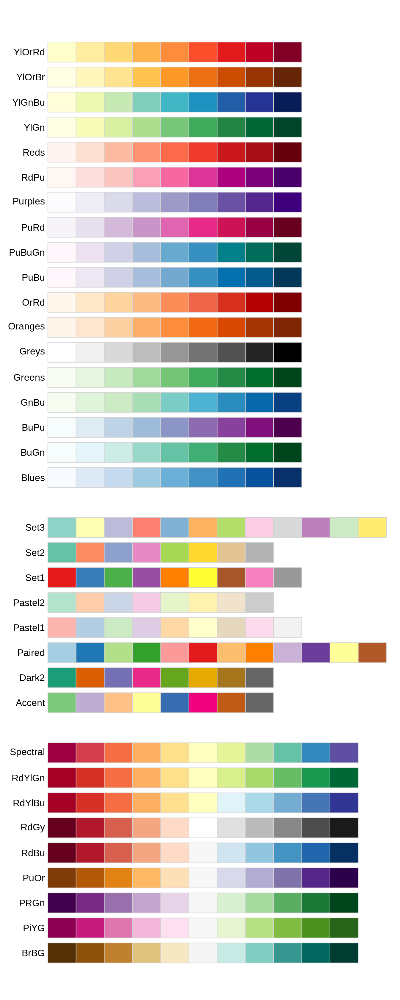

## Announcement

- Mid-term evaluation (voluntary, anonymous, ~ 10 min)

    - 3 / 19

- HW1 due today
    
- HW2 will be posted on Friday

- HW1 and project description will be graded this weekend

  - Check if you forgot to `merge` from develop branch into master branch
  
  - git push them into your repository (even if you have emailed me, just in case...)
  
  - HW1 will be graded by two questions (selected non-randomly)

- Lab keys are for you to check your results.

  - If your function behaves differently from what you expect, time to *DEBUG*
  
- Try using your local `git` application.  Try not to upload files via GitHub webpage.

  - At the minimum, avoid "Add files via upload" as commit message ([Howto](https://stackoverflow.com/questions/56085134/what-is-add-files-via-upload-commit-message-in-github-repositories)).

## Acknowledgement

Dr. Hua Zhou's [slides](https://ucla-biostat203b-2020winter.github.io/slides/06-vis/ggplot2.html)


```{r}
rm(list = ls()) # clean-up workspace
library("tidyverse")
sessionInfo()
```


# Coordinate systems | r4ds chapter 3.9

- Recall the mpg data:
    ```{r}
    mpg
    ```

- Boxplots (grouped by class):
    ```{r}
    ggplot(data = mpg, mapping = aes(x = class, y = hwy)) + 
      geom_boxplot()
    ```

----

- `coord_cartesian()` is the default cartesian coordinate system:
    ```{r}
    ggplot(data = mpg, mapping = aes(x = class, y = hwy)) + 
      geom_boxplot() + 
      coord_cartesian(xlim = c(0, 5))
    ```

----

- `coord_fixed()` specifies aspect ratio (x / y):
    ```{r}
    ggplot(data = mpg, mapping = aes(x = class, y = hwy)) + 
      geom_boxplot() + 
      coord_fixed(ratio = 1/2)
    ```

----

- `coord_flip()` flips x- and y- axis:
    ```{r}
    ggplot(data = mpg, mapping = aes(x = class, y = hwy)) + 
      geom_boxplot() + 
      coord_flip()
    ```

--- 

- Pie chart:
    ```{r}
    bar <- ggplot(data = diamonds) + 
      geom_bar(
        mapping = aes(x = cut, fill = cut), 
        show.legend = FALSE,
        width = 1
      ) + 
      theme(aspect.ratio = 1) +
      labs(x = NULL, y = NULL)
    
    bar + coord_flip()
    bar + coord_polar()
    ```

----

- A map:
    ```{r}
    library("maps")
    nz <- map_data("nz")
    head(nz, 20)
    ```
    
----    

```{r}
ggplot(nz, aes(x = long, y = lat, group = group)) +
  geom_polygon(fill = "white", colour = "black")
```

----

- `coord_quickmap()` puts maps in scale:
    ```{r}
    ggplot(nz, aes(long, lat, group = group)) +
      geom_polygon(fill = "white", colour = "black") +
      coord_quickmap()
    ```


# Graphics for communications | r4ds chapter 28

## Label

`labs()`

### Title

- Figure title should be descriptive:
    ```{r, message = FALSE}
    ggplot(mpg, aes(x = displ, y = hwy)) +
      geom_point(aes(color = class)) +
      geom_smooth(se = FALSE) +
      labs(title = "Fuel efficiency generally decreases with engine size")
    ```

### Subtitle and caption 

- `subtitle` adds additional detail in a smaller font beneath the title.

- `caption` adds text at the bottom right of the plot, often used to describe the source of the data.

    ```{r, message = FALSE}
    ggplot(mpg, aes(displ, hwy)) +
      geom_point(aes(color = class)) +
      geom_smooth(se = FALSE) + 
      labs(
        title = "Fuel efficiency generally decreases with engine size",
        subtitle = "Two seaters (sports cars) are an exception because of their light weight",
        caption = "Data from fueleconomy.gov"
      )
    ```
    
### Axis labels 

- 
    ```{r, message = FALSE}
    ggplot(mpg, aes(displ, hwy)) +
    geom_point(aes(colour = class)) +
    geom_smooth(se = FALSE) +
    labs(
      x = "Engine displacement (L)",
      y = "Highway fuel economy (mpg)"
    )
    ```

### Math equations 

- read about available options in `?plotmath` 

    ```{r}
    df <- tibble(x = runif(10), y = runif(10))
    ggplot(df, aes(x, y)) + geom_point() +
      labs(
        x = quote(sum(x[i] ^ 2, i == 1, n)),
        y = quote(alpha + beta + frac(delta, theta))
      )
    ```
    
- R package `latex2exp` could convert tex math expressions ([Ref](https://stackoverflow.com/questions/12514612/how-to-annotate-ggplot-with-latex))

    ```{r}
    library(latex2exp)
    df <- tibble(x = runif(10), y = runif(10))
    ggplot(df, aes(x, y)) + geom_point() +
      labs(
        y = TeX("Example: $\\alpha + \\beta + \\frac{\\delta}{\\theta}$"),
        x = TeX("$\\sum_{i = 1}^{n} x_i^2$")
      )
    ```


## Annotations 

- Find the most fuel efficient car in each car class:
    ```{r}
    best_in_class <- mpg %>%
      group_by(class) %>%
      filter(row_number(desc(hwy)) == 1)
    
    # equivalent as 
    # best_in_class <- filter(group_by(mpg, class), row_number(desc(hwy)) == 1)
    best_in_class
    ```

- `dplyr::desc` function transforms a vector into a format that will be sorted in descending order

- `dplyr::filter` function subsets a data frame, retaining all rows that satisfy your conditions

---

- Annotate points

```{r}
ggplot(mpg, aes(x = displ, y = hwy)) +
  geom_point(aes(colour = class)) +
  geom_text(aes(label = model), data = best_in_class)
```

---

- `geom_label()` draws a rectangle behind the text

```{r}
ggplot(mpg, aes(displ, hwy)) +
  geom_point(aes(colour = class)) +
  geom_label(aes(label = model), data = best_in_class, nudge_y = 2, alpha = 0.5)
```
    
----

- `ggrepel` package automatically adjust labels so that they don’t overlap:
    ```{r}
    library("ggrepel")
    ggplot(mpg, aes(displ, hwy)) +
      geom_point(aes(colour = class)) +
      geom_point(size = 3, shape = 1, data = best_in_class) +
      ggrepel::geom_label_repel(aes(label = model), data = best_in_class)
    ```
    
## Scales

- 
    ```{r, eval=FALSE}
    ggplot(mpg, aes(displ, hwy)) +
      geom_point(aes(colour = class))
    ```
automatically adds scales
    ```{r}
    ggplot(mpg, aes(displ, hwy)) +
      geom_point(aes(colour = class)) +
      scale_x_continuous() +
      scale_y_continuous() +
      scale_colour_discrete()
    ```

----

- `breaks`
    ```{r}
    ggplot(mpg, aes(displ, hwy)) +
      geom_point() +
      scale_y_continuous(breaks = seq(15, 40, by = 5))
    ```
---

When you have relatively few data and want to highlight exactly where the observations occur.
This plot that shows when each US president started and ended their term.

```{r}
presidential %>%
  mutate(id = 33 + row_number()) %>%
  ggplot(aes(start, id)) +
    geom_point() +
    geom_segment(aes(xend = end, yend = id)) +
    scale_x_date(NULL, breaks = presidential$start, date_labels = "'%y")
```

----

- `labels`
    ```{r}
    ggplot(mpg, aes(displ, hwy)) +
      geom_point() +
      scale_x_continuous(labels = NULL) +
      scale_y_continuous(labels = NULL)
    ```

----

- Plot y-axis at log scale:
    ```{r}
    ggplot(mpg, aes(x = displ, y = hwy)) +
      geom_point() +
      scale_y_log10()
    ```

----

- Plot x-axis in reverse order:
    ```{r}
    ggplot(mpg, aes(x = displ, y = hwy)) +
      geom_point() +
      scale_x_reverse()
    ```

----

- ColorBrewer scales are documentd online at [http://colorbrewer2.org/](http://colorbrewer2.org/)

- Available via **RColorBrewer** package

<p align="center">

</p>

- Current favorite, R package [wesanderson](https://github.com/karthik/wesanderson) that stores [Wes Anderson Palettes](https://wesandersonpalettes.tumblr.com/).

```{r}
#install.packages("wesanderson")
library(wesanderson)
for (name in names(wes_palettes)) {
  print(wes_palette(name))
}
```


- use `scale_colour_manual()` to use predefined mapping between values and colors

```{r}
presidential %>%
  mutate(id = 33 + row_number()) %>%
  ggplot(aes(start, id, colour = party)) +
    geom_point() +
    geom_segment(aes(xend = end, yend = id)) +
    scale_colour_manual(values = c(Republican = "red", Democratic = "blue"))
```

- the above plot can be improved

```{r}
presidential %>%
  mutate(id = 33 + row_number()) %>%
  ggplot(aes(start, id, colour = party)) +
    geom_point() +
    geom_segment(aes(xend = end, yend = id)) +
    scale_colour_manual(values = c(Republican = "red", Democratic = "blue")) +
    scale_x_date(NULL, breaks = presidential$start, date_labels = "'%y")
```

----

- use `scale_colour_gradient()` or `scale_fill_gradient()` for continuous colour

- `viridis::scale_colour_viridis()`

```{r}
df <- tibble(
  x = rnorm(10000),
  y = rnorm(10000)
)
ggplot(df, aes(x, y)) +
  geom_hex() +
  coord_fixed()

ggplot(df, aes(x, y)) +
  geom_hex() +
  viridis::scale_fill_viridis() +
  coord_fixed()
```

----

All color scales come in two variety:

   - `scale_colour_x()` for `colour` aesthetics
   
   - `scale_fill_x()` for `fill` aesthetics


## Legends

- Set legend position: `"left"`, `"right"`, `"top"`, `"bottom"`, `none`:
    ```{r, collapse = TRUE}
    ggplot(mpg, aes(displ, hwy)) +
      geom_point(aes(colour = class)) + 
      theme(legend.position = "left")
    ```

----

- See following link for more details on how to change title, labels, ... of a legend.

    <http://www.sthda.com/english/wiki/ggplot2-legend-easy-steps-to-change-the-position-and-the-appearance-of-a-graph-legend-in-r-software> 


## Zooming

- Without clipping (removes unseen data points)
    ```{r, message = FALSE}
    ggplot(mpg, mapping = aes(displ, hwy)) +
      geom_point(aes(color = class)) +
      geom_smooth() +
      coord_cartesian(xlim = c(5, 7), ylim = c(10, 30))
    ```

----

- With clipping (removes unseen data points)
    ```{r, message = FALSE, warning = FALSE}
    ggplot(mpg, mapping = aes(displ, hwy)) +
      geom_point(aes(color = class)) +
      geom_smooth() +
      xlim(5, 7) + ylim(10, 30)
    ```

    same as

    ```{r, message = FALSE, warning = FALSE}
    mpg %>%
      filter(displ >= 5, displ <= 7, hwy >= 10, hwy <= 30) %>%
      ggplot(aes(displ, hwy)) +
      geom_point(aes(color = class)) +
      geom_smooth()
    ```    

----

-
    ```{r, message = FALSE, warning = FALSE}
    ggplot(mpg, mapping = aes(displ, hwy)) +
      geom_point(aes(color = class)) +
      geom_smooth() +
      scale_x_continuous(limits = c(5, 7)) +
      scale_y_continuous(limits = c(10, 30))
    ```

----

## Themes

- 
    ```{r, message = FALSE}
    ggplot(mpg, aes(displ, hwy)) +
      geom_point(aes(color = class)) +
      geom_smooth(se = FALSE) +
      theme_bw()
    ```

----

<p align="center">

</p>

## Saving plots

```{r, collapse = TRUE}
ggplot(mpg, aes(displ, hwy)) + geom_point()
ggsave("my-plot.pdf")
```

## Cheat sheet  

[RStudio cheat sheet](https://github.com/rstudio/cheatsheets/raw/master/data-visualization-2.1.pdf) is extremely helpful.

