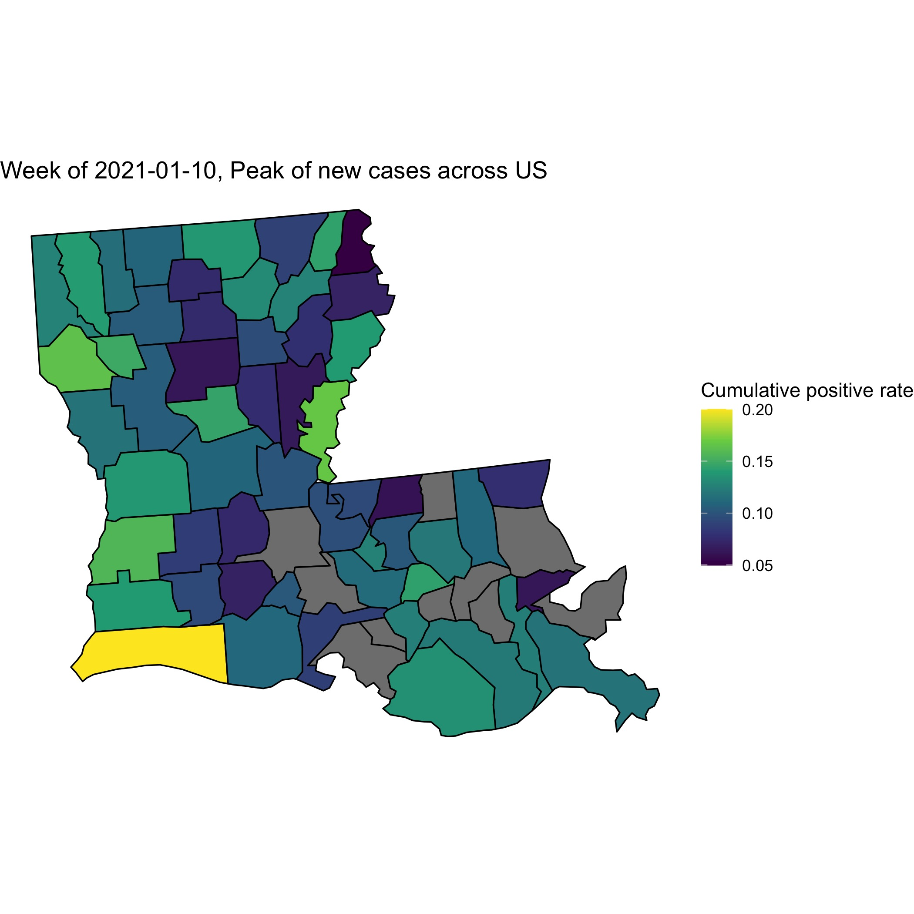
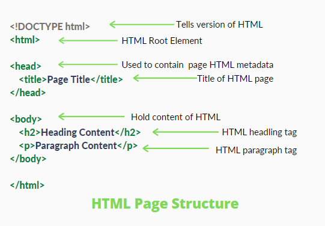
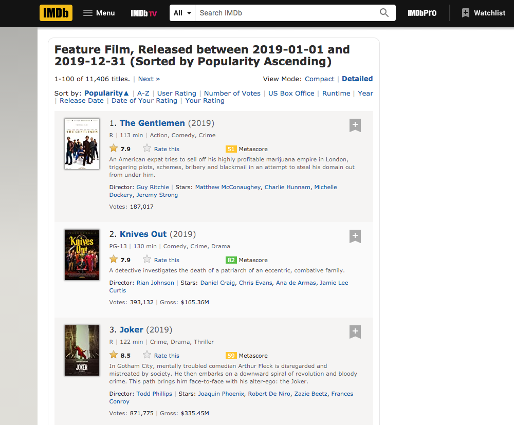
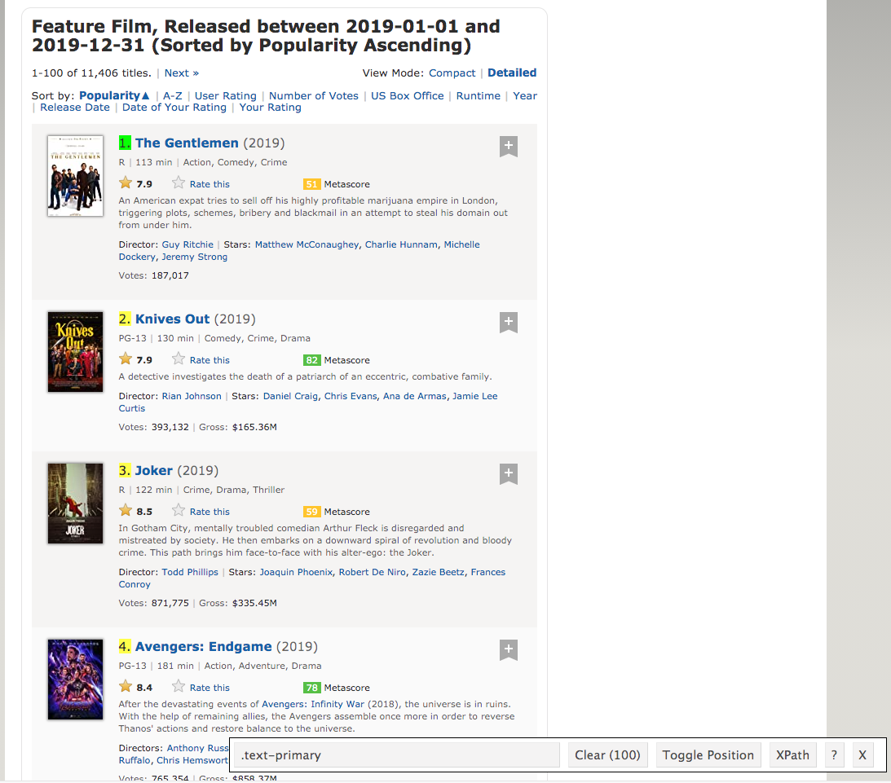
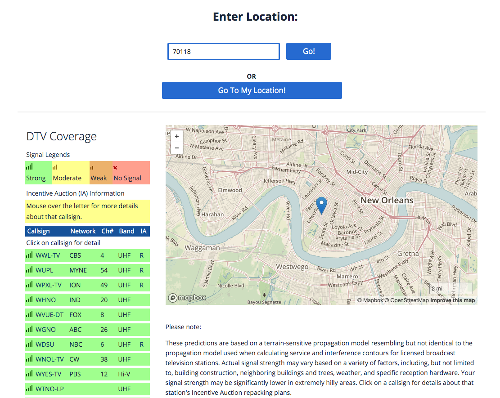
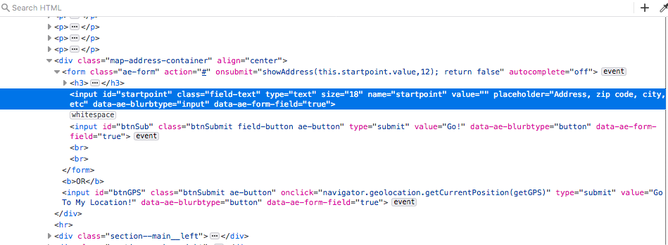

```{r setup, include=FALSE}
knitr::opts_chunk$set(fig.align = 'center', cache = TRUE)
```

## Announcement

- More HW2 questions (thank you for bringing them up)
    
  - Q1: "I'm not quite sure what the difference is between "Weekly case" and "Weekly total case"."
    - A: They mean the same thing. `weekly total case = weekly case = sum of new cases in a given week`.
  - Q4: "I have the cumulative percent positivity rates for the individual weeks required in Problem 4. Do I need to plot the cumulative positivity rate for the whole week (over 7 days, which would be one number I guess) on the map of Louisiana?"
    - A: Please calculate the cumulative positive rates by using week as the unit.  You want to plot them on a map.  Your plot should have the shape of Louisiana's map with color coded rates for each parish.
  - Q4: "I have some difficulties when working on Q4, by searching Google, I find the method to plot the dot for each city on the map of LA, this can be done by using function geocode() in “ggmap” package, but this requires an API key, I’m wondering if this is the feasible way to get the geocode for each Parish. Would you please give me some hint or reference? Thank you so much!"
    - A: I was able to use "sf", "usmap" and "map" libraries to work out Q4.  I didn't need any API keys.  I used FIPS code for parish.

<p align="center">
  
</p>


```{r}
sessionInfo()
```

## Acknowledgement

Dr. Hua Zhou's [slides](https://ucla-biostat203b-2020winter.github.io/slides/10-scraping/scraping.html)

Josh McCrain's [RSelenium tutorial](http://joshuamccrain.com/tutorials/web_scraping_R_selenium.html)

HTML Introduction [from GeeksforGeeks](https://www.geeksforgeeks.org/html-introduction/)

Getting started with HTML [MDN Web Docs](https://developer.mozilla.org/en-US/docs/Learn/HTML/Introduction_to_HTML/Getting_started)

Load tidyverse and other packages for this lecture:
```{r}
library("tidyverse")
library("rvest")
```

## HTML introduction

We cover some survival amount of instroduction of HTML format first.

**HTML** stands for HyperText Markup Language.

  - used to design web pages using a markup language
  
  - combination of Hypertext and Markup language
  
    - Hypertext defines the link between the web pages
    
    - A markup language is used to define the text document within tag which defines the structure of web pages.
  
### Elements and Tags

- HTML uses predefined **tags** and **elements** which tell the browser how to properly display the content.

- Remember to include closing tags. If omitted, the browser applies the effect of the opening tag until the end of the page.

<p align="center">
  
</p>

### Attributes

Elements can also have attributes.  Attributes look like this:

<p align="center">
  
</p>

- Attributes contain extra information about the element that won't appear in the content.

- In this example, the `class` attribute is an identifying name used to target the element with style information.

An attribute should have:

  - A space between it and the element name. (For an element with more than one attribute, the attributes should be separated by spaces too.)

  - The attribute name, followed by an equal sign.

  - An attribute value, wrapped with opening and closing quote marks.

### Anchors
Another example of an element is `<a>`.
This stands for _anchor_.
An anchor can make the text it encloses into a **hyperlink**. Anchors can take a number of attributes, but several are as follows:

- `href`: This attribute's value specifies the web address for the link. For example: `href="https://www.mozilla.org/"`.
  
- `title`: The `title` attribute specifies extra information about the link, such as a description of the page that is being linked to. For example, `title="The Mozilla homepage"`. This appears as a tooltip when a cursor hovers over the element.
  
- `target`: The `target` attribute specifies the browsing context used to display the link. For example, `target="_blank"` will display the link in a new tab. If you want to display the linked content in the current tab, just omit this attribute.

### HTML page structure

- The basic structure of an HTML page is laid out below. 

- It contains the essential building-block elements upon which all web pages are created.

  - doctype declaration
  
  - HTML
  
  - head
  
  - title
  
  - body elements

<p align="center">
  
</p>

### HTML comments

To write an HTML comment, wrap it in the special markers `<!-- and -->`. For example:

>`<p>I'm not inside a comment</p>`

>`<!-- <p>I am!</p> -->`

generates:
<p>I'm not inside a comment</p>

<!-- <p>I am!</p> -->

----------------------------------------------------------------------------

## Web scraping

There is a wealth of data on internet. How to scrape them and analyze them?

## rvest

[rvest](https://github.com/hadley/rvest) is an R package written by Hadley Wickham which makes web scraping easy.

## Example: Scraping from webpage

- We follow instructions in a [Blog by SAURAV KAUSHIK](https://www.analyticsvidhya.com/blog/2017/03/beginners-guide-on-web-scraping-in-r-using-rvest-with-hands-on-knowledge/) to find the most popular feature films of 2019.

- Install the [SelectorGadget](https://selectorgadget.com/) extension for Chrome.

- The 100 most popular feature films released in 2019 can be accessed at page <https://www.imdb.com/search/title?count=100&release_date=2019,2019&title_type=feature>.

    ```{r}
    #Loading the rvest and tidyverse package
    #Specifying the url for desired website to be scraped
    url <- "http://www.imdb.com/search/title?count=100&release_date=2019,2019&title_type=feature"
    #Reading the HTML code from the website
    (webpage <- read_html(url))
    ```

- Suppose we want to scrape following 11 features from this page:
    - Rank
    - Title
    - Description
    - Runtime
    - Genre
    - Rating
    - Metascore
    - Votes
    - Gross_Eerning_in_Mil
    - Director
    - Actor

<p align="center">
  
</p>

### Rank

- Use SelectorGadget to highlight the element we want to scrape

<p align="center">
  
</p>

- Use the CSS selector to get the rankings
    ```{r}
    # Use CSS selectors to scrap the rankings section
    (rank_data_html <- html_nodes(webpage, '.text-primary'))
    # (rank_data_html <- html_nodes(webpage, '.lister-item-content .text-primary'))
    # Convert the ranking data to text
    (rank_data <- html_text(rank_data_html))
    # Turn into numerical values
    (rank_data <- as.integer(rank_data))
    ```

### Title

- Use SelectorGadget to find the CSS selector `.lister-item-header a`.

- [CSS selector reference](https://www.w3schools.com/cssref/css_selectors.asp)
    ```{r}
    # Using CSS selectors to scrap the title section
    (title_data_html <- html_nodes(webpage, '.lister-item-header a'))
    # Converting the title data to text
    (title_data <- html_text(title_data_html))
    ```
    
### Description

-
    ```{r}
    # Using CSS selectors to scrap the description section
    (description_data_html <- html_nodes(webpage, '.ratings-bar+ .text-muted'))
    # Converting the description data to text
    description_data <- html_text(description_data_html)
    # take a look at first few
    head(description_data)
    # strip the '\n'
    description_data <- str_replace(description_data, "^\\n\\s+", "")
    head(description_data)
    ```

### Runtime

-
```{r}
# Using CSS selectors to scrap the Movie runtime section
(runtime_data <- webpage %>%
  html_nodes('.runtime') %>%
  html_text() %>%
  str_replace(" min", "") %>%
  as.integer())
```

```{r}
# Using CSS selectors to scrap the Movie runtime section
runtime_data_html <- html_nodes(webpage, '.runtime')
# Converting the runtime data to text
runtime_data <- html_text(runtime_data_html)
# Let's have a look at the runtime
head(runtime_data)
# Data-Preprocessing: removing mins and converting it to numerical
runtime_data <- str_replace(runtime_data, " min", "")
runtime_data <- as.numeric(runtime_data)
#Let's have another look at the runtime data
head(runtime_data)
```

### Genre

- Collect the (first) genre of each movie:
    ```{r}
    # Using CSS selectors to scrap the Movie genre section
    genre_data_html <- html_nodes(webpage, '.genre')
    # Converting the genre data to text
    genre_data <- html_text(genre_data_html)
    # Let's have a look at the genre data
    head(genre_data)    
    # Data-Preprocessing: retrieve the first word
    genre_data <- str_extract(genre_data, "[:alpha:]+")
    # Convering each genre from text to factor
    #genre_data <- as.factor(genre_data)
    # Let's have another look at the genre data
    head(genre_data)
    ```

### Rating

-
    ```{r}
    # Using CSS selectors to scrap the IMDB rating section
    rating_data_html <- html_nodes(webpage, '.ratings-imdb-rating strong')
    # Converting the ratings data to text
    rating_data <- html_text(rating_data_html)
    # Let's have a look at the ratings
    head(rating_data)
    # Data-Preprocessing: converting ratings to numerical
    rating_data <- as.numeric(rating_data)
    # Let's have another look at the ratings data
    rating_data
    ```
    
### Votes

-
    ```{r}
    # Using CSS selectors to scrap the votes section
    votes_data_html <- html_nodes(webpage, '.sort-num_votes-visible span:nth-child(2)')
    # Converting the votes data to text
    votes_data <- html_text(votes_data_html)
    # Let's have a look at the votes data
    head(votes_data)
    # Data-Preprocessing: removing commas
    votes_data <- str_replace(votes_data, ",", "")
    # Data-Preprocessing: converting votes to numerical
    votes_data <- as.numeric(votes_data)
    #Let's have another look at the votes data
    votes_data
    ```

### Director

- [CSS selector reference](https://www.w3schools.com/cssref/css_selectors.asp)

    ```{r}
    # Using CSS selectors to scrap the directors section
    (directors_data_html <- html_nodes(webpage,'.text-muted+ p a:nth-child(1)'))
    # Converting the directors data to text
    directors_data <- html_text(directors_data_html)
    # Let's have a look at the directors data
    directors_data
    ```

### Actor

-
    ```{r}
    # Using CSS selectors to scrap the actors section
    (actors_data_html <- html_nodes(webpage, '.lister-item-content .ghost+ a'))
    # Converting the gross actors data to text
    actors_data <- html_text(actors_data_html)
    # Let's have a look at the actors data
    head(actors_data)
    ```

### Metascore

- Be careful with missing data.
    ```{r}
    # Using CSS selectors to scrap the metascore section
    metascore_data_html <- html_nodes(webpage, '.metascore')
    # Converting the runtime data to text
    metascore_data <- html_text(metascore_data_html)
    # Let's have a look at the metascore 
    head(metascore_data)
    # Data-Preprocessing: removing extra space in metascore
    metascore_data <- str_replace(metascore_data, "\\s*$", "")
    metascore_data <- as.numeric(metascore_data)
    metascore_data
    # Lets check the length of metascore data
    length(metascore_data)
    # Visual inspection finds 24, 85, 100 don't have metascore
    ms <- rep(NA, 100)
    ms[-c(24, 85, 100)] <- metascore_data
    (metascore_data <- ms)
    ```
    
### Gross

- Be careful with missing data.
    ```{r}
    # Using CSS selectors to scrap the gross revenue section
    gross_data_html <- html_nodes(webpage,'.ghost~ .text-muted+ span')
    # Converting the gross revenue data to text
    gross_data <- html_text(gross_data_html)
    # Let's have a look at the gross data
    head(gross_data)
    # Data-Preprocessing: removing '$' and 'M' signs
    gross_data <- str_replace(gross_data, "M", "")
    gross_data <- str_sub(gross_data, 2, 10)
    #(gross_data <- str_extract(gross_data, "[:digit:]+.[:digit:]+"))
    gross_data <- as.numeric(gross_data)
    # Let's check the length of gross data
    length(gross_data)
    # Visual inspection finds below movies don't have gross
    #gs_data <- rep(NA, 100)
    #gs_data[-c(1, 2, 3, 5, 61, 69, 71, 74, 78, 82, 84:87, 90)] <- gross_data
    #(gross_data <- gs_data)
    ```
    60 (out of 100) movies don't have gross data yet! We need a better way to figure out missing entries.
    ```{r}
    (rank_and_gross <- webpage %>%
      html_nodes('.ghost~ .text-muted+ span , .text-primary') %>%
      html_text() %>%
      str_replace("\\s+", "") %>%
      str_replace_all("[$M]", ""))
    ```
    ```{r}
    isrank <- str_detect(rank_and_gross, "\\.$")
    ismissing <- isrank[1:(length(rank_and_gross) - 1)] & isrank[2:(length(rank_and_gross))]
    ismissing[length(ismissing)+1] <- isrank[length(isrank)]
    missingpos <- as.integer(rank_and_gross[ismissing])
    gs_data <- rep(NA, 100)
    gs_data[-missingpos] <- gross_data
    (gross_data <- gs_data)
    ```

### Missing entries - more reproducible way

- Following code programatically figures out missing entries for metascore.
    ```{r}
    # Use CSS selectors to scrap the rankings section
    (rank_metascore_data_html <- html_nodes(webpage, '.unfavorable , .favorable , .mixed , .text-primary'))
    # Convert the ranking data to text
    (rank_metascore_data <- html_text(rank_metascore_data_html))
    # Strip spaces
    (rank_metascore_data <- str_replace(rank_metascore_data, "\\s+", ""))
    # a rank followed by another rank means the metascore for the 1st rank is missing
    (isrank <- str_detect(rank_metascore_data, "\\.$"))
    ismissing <- isrank[1:length(rank_metascore_data)-1] & 
      isrank[2:length(rank_metascore_data)]
    ismissing[length(ismissing)+1] <- isrank[length(isrank)]
    (missingpos <- as.integer(rank_metascore_data[ismissing]))
    #(rank_metascore_data <- as.integer(rank_metascore_data))
    ```

- You (students) should work out the code for finding missing positions for gross.

### Visualizing movie data

- Form a tibble:
    ```{r}
    # Combining all the lists to form a data frame
    movies <- tibble(Rank = rank_data, 
                     Title = title_data,
                     Description = description_data, 
                     Runtime = runtime_data,
                     Genre = genre_data, 
                     Rating = rating_data,
                     Metascore = metascore_data, 
                     Votes = votes_data,
                     Gross_Earning_in_Mil = gross_data,
                     Director = directors_data, 
                     Actor = actors_data)
    movies %>% print(width=Inf)
    ```
    
- How many top 100 movies are in each genre? (Be careful with interpretation.)
    ```{r}
    movies %>%
      ggplot() +
      geom_bar(mapping = aes(x = Genre))
    ```

- Which genre is most profitable in terms of average gross earnings?
    ```{r}
    movies %>%
      group_by(Genre) %>%
      summarise(avg_earning = mean(Gross_Earning_in_Mil, na.rm=TRUE)) %>%
      ggplot() +
        geom_col(mapping = aes(x = Genre, y = avg_earning)) + 
        labs(y = "avg earning in millions")
    ```
    ```{r}
    ggplot(data = movies) +
      geom_boxplot(mapping = aes(x = Genre, y = Gross_Earning_in_Mil)) + 
      labs(y = "Gross earning in millions")
    ```

- Is there a relationship between gross earning and rating? Find the best selling movie (by gross earning) in each genre    
    ```{r}
    library("ggrepel")
    (best_in_genre <- movies %>%
        group_by(Genre) %>%
        filter(row_number(desc(Gross_Earning_in_Mil)) == 1))
    ggplot(movies, mapping = aes(x = Rating, y = Gross_Earning_in_Mil)) +
      geom_point(mapping = aes(size = Votes, color = Genre)) + 
      ggrepel::geom_label_repel(aes(label = Title), data = best_in_genre) +
      labs(y = "Gross earning in millions")
    ```


## RSelenium Example: FCC's television broadcast signal strength

Many websites dynamically pull data from databases using JavasScript and JQuery 
that make them difficult to scrape.

The FCC's [dtvmaps webpage](https://www.fcc.gov/media/engineering/dtvmaps) has a simple form 
in which you enter a zip code and it gives you the available local TV stations in that zip code and their signal strength.


<p align="center">
  
</p>

You’ll also notice the URL stays fixed with different zip codes.

### Why RSelenium

- _RSelenium_ loads the page that we want to scrape and download the HTML from that page.

    - particularly useful when scraping something behind a login
    
    - simulate human behavior on a website (e.g., mouse clicking)

- _rvest_ provides typical scraping tools

```{r}
rm(list = ls()) # clean-up workspace
library("RSelenium")
library("tidyverse")
library("rvest")
```

### Open up a browser

```{r}
rD <- rsDriver(browser="firefox", port=sample(1:7360L, 1), verbose=F)
remDr <- rD[["client"]]
```

Open a webpage

```{r}
remDr$navigate("https://www.fcc.gov/media/engineering/dtvmaps")
```

<p align="center">
  
</p>

We want to send a string of text (zip code) into the form.

```{r}
zip <- "70118"
# remDr$findElement(using = "id", value = "startpoint")$clearElement()
remDr$findElement(using = "id", value = "startpoint")$sendKeysToElement(list(zip))
# other possible ("xpath", "css selector", "id", "name", "tag name", "class name", "link text", "partial link text")
```

Click on the button `Go!`

```{r}
remDr$findElements("id", "btnSub")[[1]]$clickElement()
```

### Extract data from HTML

- save HTML to an object

- use rvest for the rest

```{r}
Sys.sleep(5) # give the page time to fully load, in seconds
html <- remDr$getPageSource()[[1]]
# important to close the client
remDr$close()

signals <- read_html(html) %>% 
  html_nodes("table.tbl_mapReception") %>% # extract table nodes with class = "tbl_mapReception"
  .[3] %>% # keep the third of these tables
  .[[1]] %>% # keep the first element of this list
  html_table(fill=T) # have rvest turn it into a dataframe
signals
```

More formatting on signals

```{r}
names(signals) <- c("rm", "callsign", "network", "ch_num", "band", "rm2") # rename columns

signals <- signals %>%
  slice(2:n()) %>% # drop unnecessary first row
  filter(callsign != "") %>% # drop blank rows
  select(callsign:band) # drop unnecessary columns
signals
```

Capture all text by clicking on each Callsign

```{r}
read_html(html) %>% 
  html_nodes(".callsign") %>% 
  html_attr("onclick")
```

Extract signal by string operations

```{r}
strength <- read_html(html) %>% 
  html_nodes(".callsign") %>% 
  html_attr("onclick") %>% 
  str_extract("(?<=RX Strength: )\\s*\\-*[0-9.]+")

# (?<=…)  is a special regex expression for positive lookbehind

signals <- cbind(signals, strength)
signals
```