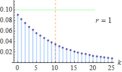

```{r setup, include=FALSE}
rm(list = ls()) # clean-up workspace
knitr::opts_chunk$set(fig.align = 'center', cache = FALSE)
library(tidyverse)
library(faraway)
```

## Announcement

- Mid-term report due 12/03/2021, HW3 due 12/10/2021.

- Negotiate presentation order switches early

## Acknowledgement

Dr. Hua Zhou's [slides](https://ucla-biostat-200c-2020spring.github.io/slides/06-count/count.html)

## Galápagos data

The `gala` data set records the number of plant species and the number of endemic species  for 30 Galápagos islands. We are interested in modeling the number of species using a regression.


```{r}
gala <- as_tibble(gala, rownames = "Island") %>%
  print(n = Inf)
```

A histogram of the number of species
```{r}
gala %>%
  ggplot() + 
  geom_histogram(mapping = aes(x = Species)) + 
  labs(title = "Species on Galápagos Islands")
```

## Poisson regession

- Assume the count response $Y_i$ follows a Poisson$(\mu_i)$ distribution with density function
$$
\mathbb{P}(Y_i = y_i) = e^{-\mu_i} \frac{\mu_i^{y_i}}{y_i!}.
$$

- The Poisson parameter $\mu_i$ is related to the predictors via an **inverse link function**
$$
\mu_i = e^{\eta_i},
$$
where $\eta_i$ is the **linear predictor** or **systematic component**
$$
\eta_i = \mathbf{x}_i^T \boldsymbol{\beta}.
$$

- The function
$$
\eta_i = g(\mu_i) = \log \mu_i
$$
that links $\mathbb{E} Y_i = \mu_i$ to the systematic component is called the **link function**. This particular link function is called the **log link function**. The Poisson regression model with log link is also called a **log-linear model**.  

- Given the $n$ independent data points $(y_i, \mathbf{x}_i)$, $i=1,\ldots,n$, the log-likelihood is
\begin{eqnarray*}
\ell(\boldsymbol{\beta}) &=& \sum_i y_i \log \mu_i - \mu_i - \log y_i! \\
&=& \sum_i y_i \cdot \mathbf{x}_i^T \boldsymbol{\beta} - e^{\mathbf{x}_i^T \boldsymbol{\beta}} - \log y_i!
\end{eqnarray*}

- We maximize the log-likelihood function to find the MLE of regression coefficient $\boldsymbol{\beta}$. 

```{r}
modp <- glm(Species ~ . - Endemics - Island, family = poisson, data = gala)
summary(modp)
```

## Interpretation

- Regression coefficients reflect the unit change in the log of Poisson mean. 
```{r}
library(gtsummary)
modp %>%
  tbl_regression(intercept = TRUE)
modp %>%
  tbl_regression(intercept = TRUE, exponentiate = TRUE)
```

## Goodness of fit

- The deviance for the Poisson regression is
\begin{eqnarray*}
  D &=& 2 \sum_i [y_i \log(y_i) - y_i] - 2 \sum_i [y_i \log (\widehat{\mu}_i) - \widehat{\mu}_i] \\
  &=& 2 \sum_i [y_i \log(y_i / \widehat{\mu}_i) - (y_i - \widehat{\mu}_i)] \\
  &=& 2 \sum_i y_i \log(y_i / \widehat{\mu}_i),
\end{eqnarray*}
where $\widehat{\mu}_i$ are the fitted values from the model. The Poisson deviance is also called the **G-statistic**.

- For the Galápagos example, comparing the deviance $D$ to $\chi_{n - p}^2$ gives an extremely small p-value (why?), indicating a lack of fit. 

- An alternative goodness of fit test compares the **Pearson $X^2$**
$$
X^2 = \sum_i \frac{(O_i - E_i)^2}{E_i} = \sum_i \frac{(y_i - \widehat{\mu}_i)^2}{\widehat{\mu}_i}
$$
to the asymptotic distribution $\chi_{n - p}^2$. Again it indicates serious lack of fit.
```{r}
# predmu = predict(modp, type = "response")
# sum((gala$Species - predmu)^2 / predmu)
(px2 <- sum(residuals(modp, type = "pearson")^2))
```

## Diagnostics

- Plot deviance residuals against linear predictor. We don't see outliers.
```{r}
gala %>%
  mutate(devres  = residuals(modp, type = "deviance"), 
         linpred = predict(modp, type = "link")) %>%
  ggplot + 
  geom_point(mapping = aes(x = linpred, y = devres)) + 
  labs(x = "Linear predictor", y = "Deviance residual")
```

- Plot Pearson residuals against linear predictor. We don't see outliers.
```{r}
gala %>%
  mutate(perres  = residuals(modp, type = "pearson"),
         linpred = predict(modp, type = "link")) %>%
  ggplot + 
  geom_point(mapping = aes(x = linpred, y = perres)) + 
  labs(x = "Linear predictor", y = "Pearson residual")
```

- Any high leverage points? `Fernandina` and `Isabela` islands have high elevation and relatively large area.
```{r}
halfnorm(hatvalues(modp))
gala %>%
  slice(c(12, 16))
```

- Any high influential points?
```{r}
halfnorm(cooks.distance((modp)))
```

- For Poisson distribution, $\mathbb{E}Y_i = \operatorname{Var}Y_i = \mu_i$. Let's check this assumption. We use $(y_i - \widehat{\mu}_i)^2$ as a crude estimate of $\operatorname{Var}Y_i$. Majority of points are above the 45 degree line. Looks like we have overdispersion. 
```{r}
gala %>%
  mutate(predmu = predict(modp, type = "response"), 
         res    = Species - predmu) %>%
  ggplot() +
  geom_point(mapping = aes(x = predmu, y = res^2)) +
  geom_abline(intercept = 0, slope = 1) +
  labs(x = expression(hat(mu)), y = expression((y - hat(mu))^2)) + 
  scale_x_log10() + 
  scale_y_log10()
```

## Overdispersion

- In **overdispersion model**, we assume an **overdispersion parameter** $\phi$ such that
$$
\operatorname{Var} Y_i = \phi \mu_i.
$$

- Given MLE, the overdispersion parameter is estimated by
$$
\widehat{\phi} = \frac{X^2}{n - p}.
$$
```{r}
(dp <- px2 / modp$df.residual)
```

- The inference on regression coefficient is changed with overdispersion parameter. We see predictors `Area`, `Elevation` and `Adjacent` are significant, but not `Nearest` and `Scruz`.
```{r}
summary(modp, dispersion = dp)
```
```{r, eval = F}
drop1(modp, scale = dp, test = "F")
```

## Quasi-Poisson

- Quasi-Poisson assumes
$$
\mathbb{E}Y_i = \mu_i, \quad \operatorname{Var}Y_i = \phi \mu_i
$$
only and yields similar inference.

```{r}
modd <- glm(Species ~ . - Endemics - Island, family = quasipoisson, data = gala)
summary(modd)
```
```{r}
drop1(modd, test = "F")
```

## Negative bionomial regression

- An alternative to Poisson model is the **negative binomial distribution** with probability mass function
$$
\mathbb{P}(Y = y) = \binom{y + r - 1}{r - 1} (1 - p)^r p^y, \quad y = 0, 1, \ldots
$$
In Friday lab, show $\mathbb{E}Y = \mu = rp / (1 - p)$ and $\operatorname{Var} Y = r p / (1 - p)^2$.



- We can relate mean response $\mu$ to the predictors via log link function
$$
\eta = \mathbf{x}^T \boldsymbol{\beta} = \log \mu.
$$

- Pre-specify `r=1` ($\theta$ in MASS) and fit negative bionomial regression:
```{r}
library(MASS)
modn <- glm(Species ~ . - Endemics - Island, family = negative.binomial(1), data = gala)
summary(modn)
```

- Estimate parameter `r` ($\theta$ in MASS) from data:
```{r}
glm.nb(Species ~ . - Endemics - Island, data = gala) %>%
  summary()
```

## Zero-inflated count models

- The `bioChemists` data set contains 915 biochemistry graduate students. The outcome of interest is the number of articles produced during the last three years of the PhD.
```{r}
library(pscl)

(bioChemists <- as_tibble(bioChemists))
```

- Descriptive statistics.
```{r}
bioChemists %>%
  ggplot() + 
  geom_bar(mapping = aes(x = art, fill = fem)) + 
  labs(x = "Articles", y = "Count", title = "Publications by PhD Students")
```

```{r}
bioChemists %>%
  ggplot() + 
  geom_bar(mapping = aes(x = art, fill = mar))
```

- We first fit a Poisson regression. A deviance of 1634.4 on 909 degrees of freedom indicates a lack of fit.
```{r}
modp <- glm(art ~ ., family = poisson, data = bioChemists)
summary(modp)
```

- The observed against fitted values plot shows the prediction for 0 is quite off.
```{r}
tibble(ocount = table(bioChemists$art)[1:8],    # observed count for 0:7
       pcount = colSums(predprob(modp)[, 1:8]), # expected count for 0:7
       count  = 0:7) %>%
  ggplot(mapping = aes(x = pcount, y = ocount, label = count)) + 
  geom_point() + 
  geom_text(nudge_y = 8) +
  labs(x = "Predicted", y = "Observed")
```

- The **hurdle model** assumes
\begin{eqnarray*}
\mathbb{P}(Y = 0) &=& f_1(0), \\
\mathbb{P}(Y = j) &=& \frac{1 - f_1(0)}{1 - f_2(0)} f_2(j), \quad j > 0.
\end{eqnarray*}
We shall use a Bernoulli response model for $f_1(1)$ to model the probability of getting over the hurdle 0, and use the zero-truncated Poisson model for $f_2$ to model the probability of observing an outcome greater than 0. 

```{r}
library(gtsummary)
modh <- hurdle(art ~ ., data = bioChemists)
summary(modh)
```

- The **zero-inflated Poisson** (ZIP) assumes a mixture model
\begin{eqnarray*}
  \mathbb{P}(Y=0) &=& \phi + (1 - \phi) f(0), \\
  \mathbb{P}(Y = j) &=& (1 - \phi) f(j), \quad j > 0,
\end{eqnarray*}
where $f$ is a Poisson model. The parameter $\phi$ represents the probaility of always observing a zero count and is modeled as a Bernoulli outcome.
```{r}
modz <- zeroinfl(art ~ ., data = bioChemists)
summary(modz)
```
The coefficients for the binary response part take opposite signs from those from the hurdle model, because hurdle model models the probability of observing a nonzero and ZIP models the probability of always observing zero.

- The hurdle model and ZIP give very similar prediction
```{r}
tibble(fitted_h = fitted(modh),
       fitted_z = fitted(modz)) %>%
  ggplot() + 
  geom_point(mapping = aes(x = fitted_h, y = fitted_z)) + 
  geom_abline(intercept = 0, slope = 1) +
  labs(x = "Hurdle predictions", y = "ZIP predictions")
```

- We can use likelihood ratio (LRT) test to compare nested models. Consider a simplied model, where the Poisson model uses predictors `fem`, `kid5`, and `ment` and the Bernoulli model uses predictor `ment`.
```{r}
modz2 <- zeroinfl(art ~ fem + kid5 + ment | ment, data = bioChemists)
summary(modz2)
```
The LRT yields a large p-value, indicating the smaller model is justifiable.
```{r}
lrt <- 2 * (modz$loglik - modz2$loglik)
pchisq(lrt, 6, lower.tail = FALSE)
```

- Interpretation
```{r}
exp(coef(modz2))
```

- Prediction. For a single male with no children whose mentor procuded six articles, we predict that the chance he produces no articles is 0.278. 
```{r}
tibble(fem = "Men", mar = "Single", kid5 = 0, ment = 6) %>%
  predict(modz2, newdata = ., type = "prob")
```
The zero part of model contributes 0.191 and the Poisson part contributes 0.087.
```{r}
tibble(fem = "Men", mar = "Single", kid5 = 0, ment = 6) %>%
  predict(modz2, newdata = ., type = "zero")
```