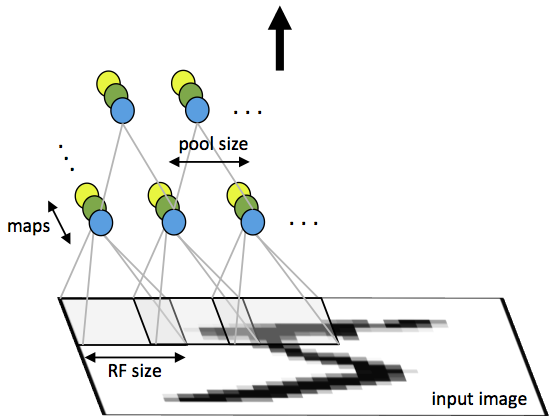
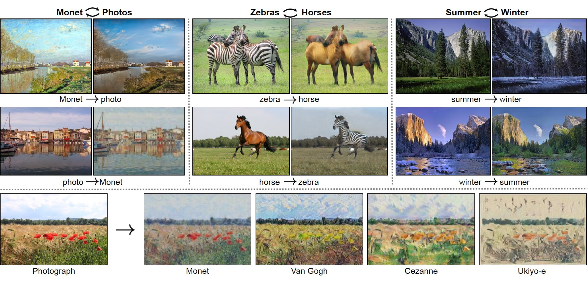

```{r setup, include=FALSE}
rm(list = ls()) # clean-up workspace
knitr::opts_chunk$set(fig.align = 'center', cache = FALSE)
```

## Announcement

- Course evaluation (2/19)

- Project mid-report due this week

- HW3 due next week

- Some comments about using code from lecture notes:

  - if it doesn't work for you, please first google the error message
  
  - you may want to compare each object from your run to those from the lecture, e.g. check their dimensions
  
  - come to the office hour (warning: it's commonly considered "rude" to ask other people debug your own code)

- Remember your homework and report

## Acknowledgement

Dr. Hua Zhou's [slides](https://ucla-biostat203b-2020winter.github.io/slides/15-nn/nn1.html)

## Practical issues

Neural networks are **not a fully automatic tool**, as they are sometimes advertised; as with all statistical models, subject matter knowledge should and often be used to improve their performance.

- Starting values: usually starting values for weights are chosen to be random values near zero; hence the model starts out nearly linear (for sigmoid), and becomes nonlinear as the weights increase.

    [Hanin and Rolnick](https://arxiv.org/abs/1803.01719) argue that a proper choice of the net and the initial random weights have to meet two requirements:  
    1. Initial weights have carefully chosen variance $\sigma^2$, which controls the mean of the computed weights. The `He uniform` in Keras makes the choice $\sigma^2 = 2 / \text{fan-in}$, where the fan-in is the maximum number of inputs to neurons.    
    2. The hidden layers in the neural net have enough neurons (not too narrow). The layer widths control the variance of the weighs.   

- Scaling of inputs: mean 0 and standard deviation 1. With standardized inputs, it is typical to take random uniform weights over the range [−0.7,+0.7].
    
- Overfitting (too many parameters):
    1. early stopping; 
    2. weight decay by $L_2$ penalty  
    $$
    L(\alpha, \beta) + \frac{\lambda}{2} \left( \sum_{k, m} \beta_{km}^2 + \sum_{m, l} \alpha_{ml}^2 \right).
    $$
    $\lambda$ is the **weight decay parameter**.  
    3. **Dropout**. At each training case, individual nodes are either dropped out of the net with probability $1-p$ or kept with probability $p$, so that a reduced network is left; incoming and outgoing edges to a dropped-out node are also removed. Forward and backpropagation for that training case are done only on this thinned network.
<p align="center">
{width=500px}
</p>
Figure from [Srivastava, Hinton, Krizhevsky, Sutskever, and Salakhutdinov (2014)](https://www.cs.toronto.edu/~hinton/absps/JMLRdropout.pdf).

- How many hidden units and how many hidden layers: guided by domain knowledge and experimentation.
    
- Multiple minima: try with different starting values.


## Convolutional neural networks (CNN)

Sources: <https://colah.github.io/posts/2014-07-Conv-Nets-Modular/>
<p align="center">
{width=500px}
</p>

- **Fully connected networks** don't scale well with dimension of input images. E.g. $1000 \times 1000$ images have about $10^6$ input units, and assuming you want to learn 1 million features (hidden units), you have about $10^{12}$ parameters to learn!

- In **locally connected networks**, each hidden unit only connects to a small contiguous region of pixels in the input, e.g., a patch of image or a time span of the input audio.

- **Convolutions**. Natural images have the property of being **stationary**, meaning that the statistics of one part of the image are the same as any other part. This suggests that the features that we learn at one part of the image can also be applied to other parts of the image, and we can use the same features at all locations by **weight sharing**.
<p align="center">
{width=400px}
</p>

    Consider $96 \times 96$ images. For each feature, first learn a $8 \times 8$ **feature detector** (or **filter** or **kernel**) from (possibly randomly sampled) $8 \times 8$ patches from the larger image. Then apply the learned detector to all $8 \times 8$ regions of the $96 \times 96$ image to obtain one $89 \times 89$ convolved feature for that feature. 
    
    From [Wang and Raj (2017)](https://arxiv.org/pdf/1702.07800.pdf):  
    <p align="center">
    {width=700px}
    </p>
    

- **Pooling**. For a neural network with 100 hidden units, we have $89^2 \times 100 = 792,100$ convolved features. This can be reduced by calculating the mean (or max) value of a particular feature over a region of the image. These summary statistics are much lower in dimension (compared to using all of the extracted features) and can also improve results (less over-fitting). We call this aggregation operation **pooling**, or sometimes **mean pooling** or **max pooling** (depending on the pooling operation applied).
<p align="center">
{width=400px}
</p>

- **Convolutional neural network (CNN)**. Convolution + pooling + multi-layer neural networks.
<p align="center">
<!-- {width=500px} -->
{width=500px}
{width=500px}
</p>

<p align="center">
{width=600px}

<p align="center">
{width=700px}
</p>

## Example: handwritten digit recognition 

<p align="center">
{width=500px}
</p>

- Input: 256 pixel values from $16 \times 16$ grayscale images. Output: 0, 1, ..., 9, 10 class-classification.
    
- A modest experiment subset: 320 training digits and 160 testing digits.
    
- net-1: no hidden layer, equivalent to multinomial logistic regression. Number of parameters is $(16 \times 16 + 1) \times 10 = 2570$.  
net-2: one hidden layer, 12 hidden units fully connected. Number of parameters is $(16 \times 16 + 1) \times 12 + (13 \times 10) = 3214$.  
net-3: two hidden layers locally connected. Each unit of the _first hidden layer_ takes input from a $3 \times 3$ patch; neighboring patches overlap by by one row or column. Each unit of the second hidden layer takes input from a $5 \times 5$ patch; neighboring patches are two units apart. Number of parameters is $(3 \times 3 + 1) \times 64 + (5 \times 5 + 1) \times 16 + (16 + 1) \times 10 = 1226$.  
net-4: two hidden layers, locally connected with weight sharing. $(3 \times 3 + 64) \times 2 +    (5 \times 5 + 1) \times 16 + (16 + 1) * 10 = 1148$ (**???**).   
net-5: two hidden layers, locally connected, two levels of weight sharing (was the result of many person years of experimentation).   

<p align="center">
{width=500px}
</p>    

Results (320 training cases, 160 test cases):

  | network | links | weights | accuracy |
  |---------|-------|---------|----------|
  | net 1   | 2570  | 2570    | 80.0%    |
  | net 2   | 3124  | 3214    | 87.0%    |
  | net 3   | 1226  | 1226    | 88.5%    |
  | net 4   | 2266  | 1131    | 94.0%    |
  | net 5   | 5194  | 1060    | 98.4%    |  

Net-5 and similar networks were state-of-the-art in early 1990s.

- On the larger benchmark dataset **MNIST** (60,000 training images, 10,000 testing images), accuracies of following methods were reported:

    | Method | Error rate  |
    |--------|----------|
    | tangent distance with 1-nearest neighbor classifier | 1.1% |
    | degree-9 polynomial SVM | 0.8% |
    | LeNet-5 | 0.8% |  
    | boosted LeNet-4 | 0.7% |


## Example: image classification

Source: <http://cs231n.github.io/convolutional-networks/>

- **AlexNet**: [Krizhevsky, Sutskever, Hinton (2012)](http://www.cs.toronto.edu/~fritz/absps/imagenet.pdf)

- [ImageNet](http://www.image-net.org) dataset. Classify 1.2 million high-resoultion images ($224 \times 224 \times 3$) into 1000 classes.

- A combination of techniques: GPU, ReLU, DropOut (0.5), SGD + Momentum with 0.9, initial learning rate 0.01 and again reduced by 10 when validation accuracy become flat.

- 5 convolutional layers, pooling interspersed, 3 fully connected layers. 60 million parameters, 650,000 neurons.
<p align="center">
{width=500px}
</p>

- AlexNet was the winner of the ImageNet Large Scale Visual Recognition Challenge (ILSVRC) classification the benchmark in 2012.

- Achieved 62.5% accuracy:
<p align="center">
{width=500px}
</p>  
96 learnt filters:  
<p align="center">
{width=500px}
</p>

### Other popular architectures

Source: [Architecture comparison of AlexNet, VGGNet, ResNet, Inception, DenseNet](https://towardsdatascience.com/architecture-comparison-of-alexnet-vggnet-resnet-inception-densenet-beb8b116866d)

- **VGGNet** was the runner up of the ImageNet Large Scale Visual Recognition Challenge (ILSVRC) classification the benchmark in 2014.

<p align="center">
{width=400px}
</p>

<p align="center">
{height=400px}
</p>

<p align="center">
{width=400px}
</p>

- **ResNet** secured 1st Position in ILSVRC and COCO 2015 competition with just error rate of 3.6% of error rate. (Better than Human Performance !!!) Batch Normalization after every conv layer. It also uses Xavier initialization with SGD + Momentum. The learning rate is 0.1 and is divided by 10 as validation error becomes constant. Moreover, batch-size is 256 and weight decay is 1e-5. The important part is there is no dropout is used in ResNet.

<p align="center">
{width=400px}
</p>

- **Inception**. Inception-v3 with 144 crops and 4 models ensembled, the top-5 error rate of 3.58% is obtained, and finally obtained 1st Runner Up (image classification) in ILSVRC 2015.

<p align="center">
{width=600px}
</p>

- **DenseNet**.

<p align="center">
{width=500px}
</p>


## Recurrent neural networks (RNN)

- Sources: 
    - <http://web.stanford.edu/class/cs224n/>   
    - <https://colah.github.io/posts/2015-08-Understanding-LSTMs/>  
    - <http://karpathy.github.io/2015/05/21/rnn-effectiveness/>  
    - <http://www.wildml.com/2015/09/recurrent-neural-networks-tutorial-part-1-introduction-to-rnns/>  
    
- MLP (multi-layer perceptron) and CNN (convolutional neural network) are examples of **feed forward neural network**, where connections between the units do not form a cycle.  

- MLP and CNN accept a fixed-sized vector as input (e.g. an image) and produce a fixed-sized vector as output (e.g. probabilities of different classes). 

- **Reccurent neural networks (RNN)** instead have loops, which can be un-rolled into a sequence of MLP.

<p align="center">
<!-- {width=100px} -->
{width=500px}
</p>

- RNNs allow us to operate over sequences of vectors: sequences in the input, the output, or in the most general case both.

- Applications of RNN: 

    - [Language modeling and generating text](http://karpathy.github.io/2015/05/21/rnn-effectiveness/). E.g., search prompt, messaging/email prompt, ...
    
    <p align="center">
    {width=500px}
    </p>
    
    Above: generated (fake) LaTeX on algebraic geometry; see <http://karpathy.github.io/2015/05/21/rnn-effectiveness/>.

    - **NLP/Speech**: transcribe speech to text, machine translation, sentiment analysis, ...
    <p align="center">
    {width=500px}
    </p>
    
    - **Computer vision**: image captioning, video captioning,  ...
    <p align="center">
    {width=500px}
    </p>

- RNNs accept an input vector $x$ and give you an output vector $y$. However, crucially this output vector’s contents are influenced not only by the input you just fed in, but also on the entire history of inputs you’ve fed in the past.

- Short-term dependencies: to predict the last word in "the clouds are in the _sky_":
<p align="center">
{width=500px}
</p>

- Long-term dependencies: to predict the last word in "I grew up in France... I speek fluent _French_":
<p align="center">
{width=500px}
</p>

- Typical RNNs are having trouble with learning long-term dependencies.
<p align="center">
{width=500px}
</p>

- **Long Short-Term Memory networks (LSTM)** are a special kind of RNN capable of learning long-term dependencies. 
<p align="center">
{width=500px}
{width=500px}
</p>

    The **cell state** allows information to flow along it unchanged.
    <p align="center">
    {width=500px}
    </p>
    The **gates** give the ability to remove or add information to the cell state.
    <p align="center">
    {width=100px}
    </p>
    
## Generative Adversarial Networks (GANs)

> The coolest idea in deep learning in the last 20 years.  
> - Yann LeCun on GANs.

- Sources: 
    - <https://sites.google.com/view/cvpr2018tutorialongans/>   
    - <https://medium.com/ai-society/gans-from-scratch-1-a-deep-introduction-with-code-in-pytorch-and-tensorflow-cb03cdcdba0f>    
    - <https://skymind.ai/wiki/generative-adversarial-network-gan>   

- Applications:

    - Image-to-image translation 
    
    <p align="center">
    {width=600px}
    </p>

    * AI-generated celebrity photos: <https://www.youtube.com/watch?v=G06dEcZ-QTg>
    
    * Self play

<p align="center">
{width=600px}
</p>

* GAN:

<p align="center">
{width=600px}
</p>


* Value function of GAN
$$
\min_G \max_D V(D, G) = \mathbb{E}_{x \sim p_{\text{data}}(x)} [\log D(x)] + \mathbb{E}_{z \sim p_z(z)} [\log (1 - D(G(z)))].
$$

* Training GAN

<p align="center">
{width=600px}
</p>

## Software

- High-level software focuses on user-friendly interface to specify and train models.  
[Keras](https://keras.io), [PyTorch](http://pytorch.org) (only Linux and MacOS), [scikit-learn](http://scikit-learn.org/stable/), ...

- Lower-level software focuses on developer tools for impelementing deep learning models.   
[TensorFlow](https://www.tensorflow.org), [Theano](http://deeplearning.net/software/theano/#), [CNTK](https://github.com/Microsoft/CNTK), [Caffe](http://caffe.berkeleyvision.org), [Torch](http://torch.ch), ...

- Most tools are developed in Python plus a low-level language.

## TensorFlow

- Developed by Google Brain team for internal Google use. Formerly DistBelief.

- Open sourced in Nov 2015.

- OS: Linux, MacOS, and Windows (since Nov 2016).

- GPU support: NVIDIA CUDA.

- TPU (tensor processing unit), built specifically for machine learning and tailored for TensorFlow.

- Mobile device deployment: TensorFlow Lite (May 2017) for Android and iOS.

<p align="center">
{width=600px}
</p>


- Used in a variety of Google apps: speech recognition (Google assistant), Gmail (Smart Reply), search, translate, self-driving car ...

> when you have a hammer, everything looks like a nail.  

<p align="center">
{width=200px}
</p>

- [Machine Learning Crash Course (MLCC)](https://developers.google.com/machine-learning/crash-course/?utm_source=google-ai&utm_medium=card-image&utm_campaign=training-hub&utm_content=ml-crash-course). A 15 hour workshop available to public since March 1, 2018.

## R/RStudio

R users can access Keras and TensorFlow via the `keras` and `tensorflow` packages. 

```{r, eval=FALSE}
#install.packages("keras")
library(keras)
install_keras()
# install_keras(tensorflow = "gpu") # if NVIDIA GPU is available
```

<!-- Questions: -->

<!-- - How much is CPU usage? Are all cores being used? -->

<!-- - Is training loss monotone? Is validation loss monotone? Is testing error monotone? -->

<!-- - What are epoches? Does loss always decrease with epoches? Does training error always decrease with epoches? -->

<!-- -  -->

## Example: MNIST - MLP

[Rmd](./mnist_mlp/mnist_mlp.Rmd), [html](./mnist_mlp/mnist_mlp.html).

## Example: MNIST - CNN

[Rmd](./mnist_cnn/mnist_cnn.Rmd), [html](./mnist_cnn/mnist_cnn.html).

## Example: IMDB review sentiment analysis - RNN LSTM

[Rmd](./imdb_lstm/imdb_lstm.Rmd), [html](./imdb_lstm/imdb_lstm.html).

## Youtube free course

[Keras - Python Deep Learning Neural Network API](https://www.youtube.com/playlist?list=PLZbbT5o_s2xrwRnXk_yCPtnqqo4_u2YGL)

<!-- ## Example: Generate text from Nietzsche’s writings - RNN LSTM -->

<!-- [Rmd](http://raw.githubusercontent.com/Hua-Zhou/Hua-Zhou.github.io/master/teaching/biostatm280-2019winter/slides/15-nn/nietzsche_lstm/nietzsche_lstm.Rmd), [html](./nietzsche_lstm/nietzsche_lstm.html). -->

<!-- ## Example: Generate handwritten digits from MNIST - GAN -->

<!-- [Rmd](http://raw.githubusercontent.com/Hua-Zhou/Hua-Zhou.github.io/master/teaching/biostatm280-2019winter/slides/15-nn/mnist_acgan/mnist_acgan.Rmd), [html](./mnist_acgan/mnist_acgan.html). -->