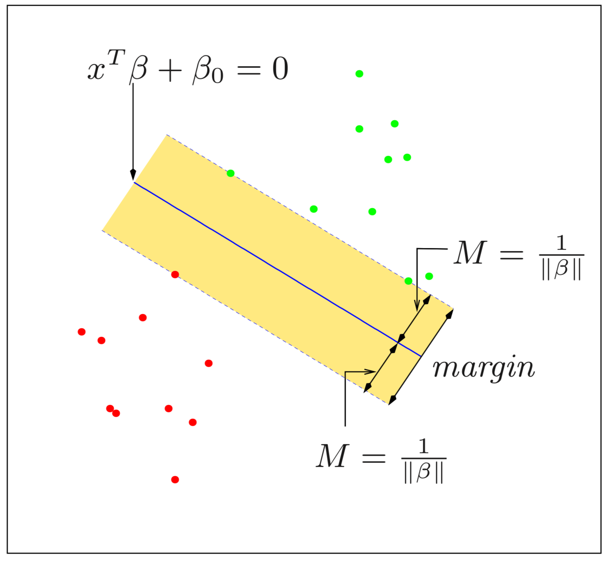

```{r setup, include=FALSE}
rm(list = ls()) # clean-up workspace
knitr::opts_chunk$set(fig.align = 'center', cache = FALSE)
```


## Acknowledgement

[The Elements of Statistical Learning](https://web.stanford.edu/~hastie/ElemStatLearn/), chapters 4 and 12

[http://uc-r.github.io/svm](http://uc-r.github.io/svm)


## Linearly discriminant analysis

\DeclareMathOperator*{\argmax}{arg\,max}

We first revisit linear methods for classification.
Let $G(x)$ be our predictor that takes values in a discrete set of K classes $\{1, 2, \dots, K\}$.
Here we consider a member of a class of methods that model **_discriminant functions_** $\delta_k(x)$ for each class, and classify $x$ to the class with the largest value for its discriminant function, $\hat G(x) = \argmax_k \delta_k(x)$.

Suppose $f_k(x) = \Pr(X=x | G = k)$ is the class-conditional density of $X$ in class $G=k$, and let $\pi_k = \Pr(G = k)$ be the prior probability of class k, with $\sum_{k=1}^{K} \pi_k = 1$.  Bayes theorem gives us

$$
\Pr(G=k|X=x) = \frac{f_k(x)\pi_k}{\sum_{l=1}^K f_l(x)\pi_l}
$$

Suppose we model each class density as multivariate Gaussian
$$
f_k(x) = \frac{1}{(2\pi)^{p/2} |\mathbf{\Sigma_k}|^{1/2}} e^{-\frac{1}{2}(x-\mu_k)^T\mathbf{\Sigma}_k^{-1}(x-\mu_k)}
$$

**_Linear discriminant analysis_** (LDA) arises in the special case when we assume all classes have a common covariance matrix $\mathbf{\Sigma_k}=\mathbf{\Sigma}$.  Therefore, comparing two classes $k$ and $l$, we see
$$
\begin{aligned}
\log \frac{\Pr(G=k|X=x)}{\Pr(G=l|X=x)} 
&= \log \frac{f_k(x)}{f_l(x)} + \log \frac{\pi_k}{\pi_l} \\
&= \log \frac{\pi_k}{\pi_l} - \frac{1}{2}(\mu_k + \mu_l)^T\mathbf{\Sigma}_k^{-1}(\mu_k - \mu_l) + x^T \mathbf{\Sigma}^{-1}(\mu_k - \mu_l),
\end{aligned}
$$
is an equation linear in $x$.  This linear log-odds function implies that the decision boundary between classes $k$ and $l$ is linear in x.
This means if we divide $\mathbb{R}^p$ into regions that are classified as class 1, class 2, etc., these regions will be separated by hyperplanes.


The linear discriminant functions are
$$
\delta_k(x) = x^T\mathbf{\Sigma}^{-1}\mu_k - \frac{1}{2}\mu_k^T\mathbf{\Sigma}^{-1}\mu_k + \log \pi_k
$$

In practice, we need to estimate parameters of the Gaussian distributions using training data

- $\hat \pi_k = N_k / N$

- $\hat \mu_k = \sum_{g_i = k} x_i/N_k$

- $\hat{\mathbf{\Sigma}} = \sum_{k=1}^K \sum_{g_i = k} (x_i - \hat{\mu}_k)(x_i - \hat{\mu}_k)^T /(N-K)$.

For more general case where $\mathbf{\Sigma}_k$ are not assumed to be equal, use _quadratic discriminant functions_ (QDA),
$$
\delta_k(x) = -\frac{1}{2}\log|\mathbf{\Sigma}_k| -\frac{1}{2}(x-\mu_k)^T\mathbf{\Sigma}_k^{-1}(x-\mu_k) + \log \pi_k
$$

## _optimal_ separating hyperplane
\DeclareMathOperator{\sign}{sign}

Consider a training dataset of $N$ pairs $(x_1, y_1)$, $(x_2, y_2)$, ..., $(x_N, y_N)$, with $x_i \in \mathbb{R}^p$ and $y_i \in \{-1, 1\}$。
Define a hyperplane by
$$
\{x:f(x) = x^T\beta + \beta_0 = 0\},
$$
where $\beta$ is a unit vector: $||\beta|| = 1$. And the classification rule induced by $f(x)$ is
$$
G(x) = \sign[x^T\beta + \beta_0] 
$$

For separable classes, we can find a function $f(x) = x^T\beta + \beta_0$ such that $y_if(x_i) > 0, \forall i$.
And we can find the hyperplane that creates the biggest **_margin_** between the training points for class $1$ and $-1$ with the optimization problem
$$
\max\limits_{\beta, \beta_0, ||\beta|| = 1}M \\
\mbox{subject to } y_i(x_i^T\beta + \beta_0) \ge M, i = 1, \dots, N.
$$

And it can be more conveniently rephrased as

$$
\min\limits_{\beta, \beta_0}||\beta|| \\
\mbox{subject to } y_i(x_i^T\beta + \beta_0) \ge 1, i = 1, \dots, N,
$$
where $M = 1/||\beta||$.
This expression is the usual way of writing the support vector criterion for separated data.



## Support vector classifier

Suppose now that classes overlap in feature space.
One way to deal with the overlap is to still maximize $M$, with some modification:
$$
y_i(x_i^T\beta + \beta_0) \ge M - \xi_i \\
\mbox{or} \\
y_i(x_i^T\beta + \beta_0) \ge M(1 - \xi_i), \\
$$
$\forall i, \xi_i \ge 0, \sum_{i = 1}^N \xi_i \le \mbox{constant}$.

- Although the first choice seems natural, it's a nonconvex optimization problem

- The second choice is convex and is the "standard" _support vector classifier_

- The equivalent form is

    $$
    \min ||\beta|| \\
    \mbox{subject to } \left\{ {\begin{array}{*{20}{c}}
{y_i(x_i^T \beta + \beta_0) \ge 1 - \xi_i, }\\
{\forall i, \xi_i \ge 0, \sum \xi_i \le \mbox{constant.}}
\end{array}} \right.
    $$


## Support vector machines and Kernels

The support vector classifier finds linear boundaries in the input feature space.
The **_support vector machine classifier_** extends the support vector classifier by feeding it with 
$$
h(x_i)=\left(h_1(x_i), h_2(x_i), \dots, h_M(x_i)\right), i = 1, \dots, N
$$
, and produce the (nonlinear) function
$$
\hat f(x) = h(x)^T \hat \beta + \beta_0
$$

- The dimension $M$ of $h(x)$ can be very large, infinite in some cases.

- The Lagrange dual function has the form

$$
L_D = \sum \limits_{i = 1}^{N}\alpha_i - \frac{1}{2}\sum \limits_{i = 1}^N \sum \limits_{i' = 1}^N \alpha_i \alpha_{i'}y_i y_{i'} \left\langle {h(x_i), h(x_{i'})} \right\rangle.
$$

- The solution function $f(x)$ can be written

$$
\begin{aligned}
f(x) &= h(x)^T \beta + \beta_0\\
&= \sum \limits_{i = 1}^{N} \alpha_i y_i \left\langle h(x), h(x_{i}) \right\rangle + \beta_0.
\end{aligned}
$$
And $\alpha_i, \beta_0$ can be determined by solving $y_if(x_i)=1, \forall x_i, 0<\alpha_i<C$.

- Both the dual function and solution only requires the **kernel** function which is the inner products in the transformed space

$$
K(x, x') = \left\langle h(x), h(x') \right\rangle
$$

- $K$ should be a symmetric positive (semi-) definite function.

- Three popular choices for $K$ are

    - **$d$th-Degree polynomial**: $K(x, x') = (1 + \left\langle x, x' \right\rangle)^d$
    
    - **Radial basis**: $K(x, x') = \exp(-\gamma ||x - x'||^2)$
    
    - **Neural network**: $K(x, x') = \tanh(\kappa_1 \left\langle x, x' \right\rangle + \kappa_2)$


## Support vector machine example

[Rmd](./example/svm_example.Rmd), [html](./example/svm_example.html).

