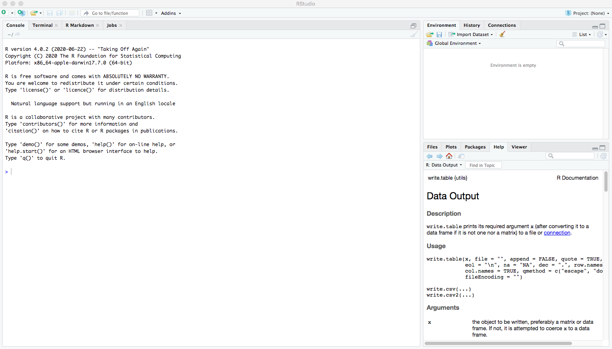
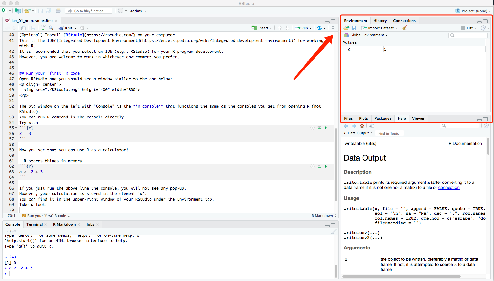
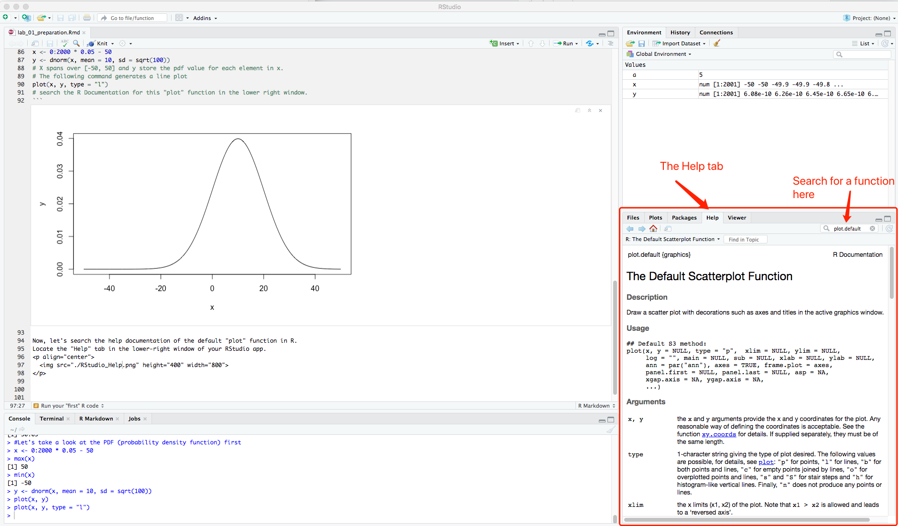

## Announcement

- Remember to [_introduce_ yourself](https://tulane.instructure.com/courses/2238421/discussion_topics/13241432?module_item_id=30871904) on Canvas.

- Remember to accept GitHub organization invites.

- [Course GitHub organization](https://github.com/tulane-math-7360-2021)

- [Course GitHub website](https://tulane-math-7360-2021.github.io/)

## GitHub account
Let's first setup a GitHub academic account.
Go to [GitHub Education](https://education.github.com/) to get your student benifit (you need to **use your tulane.edu** email address).

Once you have got your GitHub id, please tell me through email.
Your GitHub id will then be invited to the [course GitHub organization](https://github.com/tulane-math-7360-2021).

Our course has a GitHub page now.
Please take a look at <https://tulane-math-7360-2021.github.io/> and its source code at <https://github.com/tulane-math-7360-2021/tulane-math-7360-2021.github.io>.
You could check all the development history of this website through the [commit history](https://github.com/tulane-math-7360-2021/tulane-math-7360-2021.github.io/commits/main).

## R
Install [R](https://www.r-project.org/) on your computer.
This is the workhorse for R programs.


## RStudio
(Optional) Install [RStudio](https://rstudio.com/) on your computer.
This is the IDE([Integrated Development Environment](https://en.wikipedia.org/wiki/Integrated_development_environment)) for working with R.
It is recommended that you select an IDE (e.g., RStudio) for your R program development.
However, you are welcome to work in whichever environment you prefer.


## Run your "first" R code
Open RStudio and you should see a window similar to the one below:
<p align="center">
  
</p>

The big window on the left with "Console" is the **R console** that functions the same as the consoles you get from opening R (not RStudio).
You can run R command in the console directly.
Try with
```{r}
2 + 3
```

Now you see that you can use R as a calculator!

- R stores things in memory.
```{r}
a <- 2 + 3
```

If you just run the above line the console, you will not see any pop-up.
However, your calculation is stored in the element 'a'.
You can find it in the upper-right window of your RStudio under the Environment tab.
Take a look:
<p align="center">
  
</p>

And, of course you can output the value of a by
```{r}
a
```

The above screenshot also reveals that I use RStudio for writing RMarkdown files which are the source code for all of your lecture slides.
We will go through RMarkdown and git commands in next week's lab session.
Let's finish today's lab session by plotting some figures (the saying "a figure is worth a thousand words" should echo now).
We will draw $1000$ samples from a normal distribution with mean $10$ and variance $100$ (i.e., N(10, 100)).

```{r}
#Let's take a look at the PDF (probability density function) first
x <- 0:2000 * 0.05 - 50
y <- dnorm(x, mean = 10, sd = sqrt(100))
# X spans over [-50, 50] and y store the pdf value for each element in x.
# The following command generates a line plot
plot(x, y, type = "l")
# search the R Documentation for this "plot" function in the lower right window.
```

Now, let's search the help documentation of the default "plot" function in R.
Locate the "Help" tab in the lower-right window of your RStudio app.
<p align="center">
  
</p>

```{r}
# Let's draw some random variables from the distribution
normal.samples <- rnorm(1000, 10, 10)  # avoid using sample as the variable name because it's already used for a built-in function.  The bad behavior of R (python shares this overriding problem too)
# Produce a histogram of the random samples
hist(normal.samples)
```

The above histogram has the default "Frecuency" as the Y axis.  Let's change it to "Density"

```{r}
hist(normal.samples, probability = TRUE)
```

Now let's place the line plot over the histogram.

```{r}
hist(normal.samples, probability = TRUE)
lines(x, y, col="red", lwd=4)
#you may want to try the function "curve" too.  Go to its help page to find the usage.
```

This concludes our lab 1.  Please let me know if you run into any trouble.
We do not submit lab 1 onto GitHub for now.
