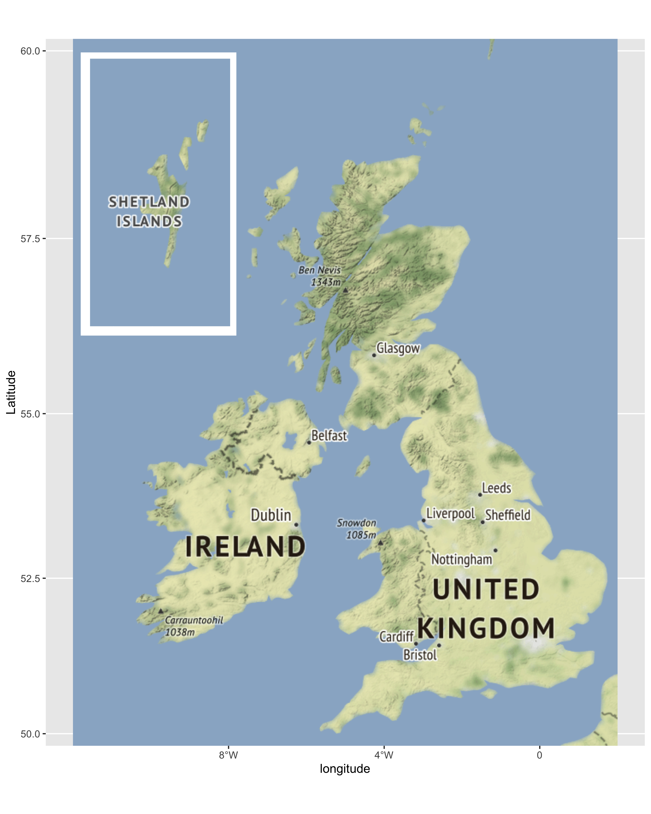

```{r}
rm(list = ls()) # clean-up workspace
library("tidyverse")
```

## Some more exercise on ggplot2

### embed a plot inside another

In this part, we want to replicate the plots in [reference](https://www.r-bloggers.com/2019/02/plots-within-plots-with-ggplot2-and-ggmap/).

1.  create the data and do the initial visualization

```{r}
set.seed(42)
n <- 1000
x <- runif(n) * 3
y <- x * sin(1/x) + rnorm(n) / 25
df <- tibble(x = x, y = y)
p1 <- ggplot(df, aes(x, y)) +
  geom_point(alpha = 0.3) +
  geom_smooth(se = FALSE) +
  theme_bw()
p1
```

Let's further take a look over the function $f(x) = x \sin(\frac{1}{x})$.

Create a new variable $z$ to store the $f(x)$ values at each $x$ point.

```{r}
df.with.z <- df %>%
  add_column(z = x * sin(1 / x))
```

Now plot another figure with two layers:

- Scatter plot of the points (x, y)

- A line by (x, z)

Put your code inside the code block, explain your findings outside the code block (so that it renders to text in the HTML file).

You may want to change `eval = TRUE` or remove it for the code to be executed.

```{r, eval = FALSE}
p2
```

Now we see that the default smoothing function doesn't catch the beginning part of these points.

Let's zoom in (with clipping) the region $x \in [0, 0.5]$ and make another plot.


```{r, eval = FALSE}
p3
```

Now embed p3 inside p1.

Please add appropriate titles and subtitles to them.

```{r, eval = FALSE}
p1 + annotation_custom(ggplotGrob(p3), xmin = 1, xmax = 3, ymin = -0.3, ymax = 0.6)
```

------------------------------------

Now please follow the second half of the [reference](https://www.r-bloggers.com/2019/02/plots-within-plots-with-ggplot2-and-ggmap/), but instead create a UK map similar to [this one](https://geology.com/world/united-kingdom-satellite-image.shtml) and save it as **uk_map.pdf**

Hint: it's time to practice your self-learning (google?) skills.

<p align="center">

<br>
<em>Target UK map</em>
</p>


<p align="center">

<br>
<em>A bad map your instructor created.</em>
</p>

```{r}
# Your code for the UK map
```
